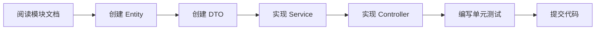

# EasyProduct 后端模块开发文档索引

> 本目录包含各业务模块的详细后端开发说明文档

---

## 📚 文档列表

### 核心模块

| 模块 | 文档 | 状态 | 说明 |
|------|------|------|------|
| **Basic** | [basic-module-development.md](./basic-module-development.md) | 🟡 生成中 | 基础管理（用户、角色、菜单、部门、字典、配置） |
| **Mall** | [mall-module-development.md](./mall-module-development.md) | 🟡 生成中 | 商城管理（会员、订单、支付、优惠券） |
| **CRM** | [crm-module-development.md](./crm-module-development.md) | 🟡 生成中 | 客户关系管理（客户、供应商、进销存、财务） |

### 业务模块

| 模块 | 文档 | 状态 | 说明 |
|------|------|------|------|
| **Product** | [product-module-development.md](./product-module-development.md) | 🟡 生成中 | 商品管理（分类、SPU、SKU、渠道） |
| **Site** | [site-module-development.md](./site-module-development.md) | 🟡 生成中 | 官网内容管理（新闻、Banner、视频、下载） |
| **App** | [app-module-development.md](./app-module-development.md) | 🟡 生成中 | 小程序会员端（微信登录、订单、支付） |

### 支撑模块

| 模块 | 文档 | 状态 | 说明 |
|------|------|------|------|
| **Workflow** | [workflow-module-development.md](./workflow-module-development.md) | 🟡 生成中 | 工作流引擎（流程定义、审批、任务） |
| **Report & Ops** | [report-ops-module-development.md](./report-ops-module-development.md) | 🟡 生成中 | 报表引擎 + 运维管理 |

---

## 📋 文档内容结构

每个模块的开发文档都包含以下内容：

### 1. 模块概述
- 业务背景
- 功能范围
- 技术选型

### 2. 技术栈和依赖
- NuGet 包依赖
- 第三方服务
- 框架组件

### 3. 实体类设计
- Entity 类定义
- 数据库映射配置
- 主键和索引设计

### 4. DTO 设计
- Request DTO（输入参数）
- Response DTO（输出结果）
- Query DTO（查询参数）

### 5. Service 层实现指南
- 接口定义规范
- 方法注释规范（中文）
- 业务逻辑实现
- 事务处理

### 6. Controller 层实现指南
- 路由设计
- 参数验证
- 响应封装
- 异常处理

### 7. 数据库表设计
- CREATE TABLE 语句
- 索引设计
- 外键约束

### 8. 业务逻辑要点
- 核心业务流程
- 状态机设计
- 数据一致性保证

### 9. 单元测试要求
- 测试覆盖要求
- 关键测试场景
- 涉钱逻辑强制测试

### 10. 开发检查清单
- 提交前检查项
- 代码规范验证
- 性能优化建议

---

## 🎯 开发优先级

根据 mock 状态和业务重要性，建议按以下优先级开发：

### P1 阶段（最高优先级）
1. **Basic 模块** - 基础认证和权限骨架
   - 用户管理
   - 角色管理
   - 菜单管理
   - 字典管理

### P2 阶段
2. **Site 模块** - 官网内容管理
   - 新闻管理
   - Banner 管理
   - 视频管理

### P3 阶段
3. **Mall 模块** - 商城核心功能
   - 会员管理
   - 订单管理
   - 支付管理

4. **App 模块** - 小程序会员端
   - 微信登录
   - 购物车
   - 订单

### P4 阶段
5. **Product 模块** - 商品管理
   - 商品分类
   - SPU/SKU

6. **CRM 模块** - 客户关系管理
   - 客户管理
   - 供应商管理
   - 进销存

### P5 阶段
7. **Workflow 模块** - 工作流
8. **Report 模块** - 报表
9. **Ops 模块** - 运维管理

---

## 🔗 相关文档

### API 接口文档
- [API 接口总览](../../api/README.md)
- [Basic 模块接口](../../api/basic-module.md)
- [Mall 模块接口](../../api/mall-module.md)
- [CRM 模块接口](../../api/crm-module.md)

### 规范文档
- [后端开发规范](../../backend-guidelines.md)
- [数据库设计规范](../../database-design-guidelines.md)
- [代码注释规范](../../code-comment-guidelines.md)

### Autofac 注入
- [属性注入迁移指南](../autofac-property-injection-migration.md)
- [迁移完成报告](../autofac-migration-complete.md)

---

## ⚠️ 开发注意事项

### 1. 代码规范
- ✅ 所有方法必须添加中文注释
- ✅ 使用属性注入（无需构造函数）
- ✅ 统一使用 ApiResponse 封装响应
- ✅ 异常不捕获，由全局中间件处理

### 2. 数据规范
- ✅ 主键使用 GUID 字符串
- ✅ JSON 使用 camelCase
- ✅ 数据库使用 snake_case
- ✅ 分页 pageIndex 从 1 开始

### 3. 测试规范
- ✅ 涉钱逻辑必须编写单元测试
- ✅ 提交前运行 `dotnet build` 0 错误 0 警告
- ✅ 提交前运行 `dotnet test` 全部通过

### 4. Git 规范
- ✅ 提交信息遵循 Conventional Commits
- ✅ scope 使用 `api`（后端）
- ✅ 示例：`feat(api): 添加用户管理接口`

---

## 📊 开发进度跟踪

| 模块 | Entity | DTO | Service | Controller | Test | 状态 |
|------|--------|-----|---------|-----------|------|------|
| Basic | ⬜ | ⬜ | ⬜ | ⬜ | ⬜ | 未开始 |
| Mall | ⬜ | ⬜ | ⬜ | ⬜ | ⬜ | 未开始 |
| CRM | ⬜ | ⬜ | ⬜ | ⬜ | ⬜ | 未开始 |
| Product | ⬜ | ⬜ | ⬜ | ⬜ | ⬜ | 未开始 |
| Site | ⬜ | ⬜ | ⬜ | ⬜ | ⬜ | 未开始 |
| App | ⬜ | ⬜ | ⬜ | ⬜ | ⬜ | 未开始 |
| Workflow | ⬜ | ⬜ | ⬜ | ⬜ | ⬜ | 未开始 |
| Report | ⬜ | ⬜ | ⬜ | ⬜ | ⬜ | 未开始 |
| Ops | ⬜ | ⬜ | ⬜ | ⬜ | ⬜ | 未开始 |

**图例：**
- ⬜ 未开始
- 🟡 进行中
- ✅ 已完成

---

## 🚀 快速开始

### 1. 创建新模块

```bash
# 1. 创建实体类
# EasyProduct.Models/Entitys/{Module}/{Entity}.cs

# 2. 创建 DTO
# EasyProduct.Models/Dto/{Module}/{Entity}Dto.cs

# 3. 创建 Service 接口
# EasyProduct.Business/{Module}/I{Entity}Service.cs

# 4. 创建 Service 实现
# EasyProduct.Business/{Module}/{Entity}Service.cs

# 5. 创建 Controller
# EasyProduct.Web/Controllers/Admin/{Module}/{Entity}Controller.cs
```

### 2. 开发流程



### 3. 示例：创建用户管理功能

参考：
- Entity: `EasyProduct.Models/Entitys/Basic/basic_user.cs`
- DTO: `EasyProduct.Models/Dto/Basic/UserDto.cs`
- Service: `EasyProduct.Business/Basic/UserService.cs`
- Controller: `EasyProduct.Web/Controllers/Admin/Basic/UserController.cs`

---

**最后更新时间：** 2026-09-07
**维护者：** 后端开发团队