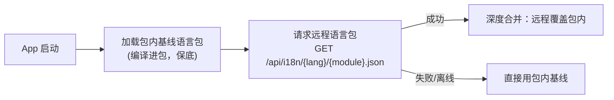

# EasyProduct 前端开发规范

> **版本：** v1.0
> **日期：** 2026-08-08
> **适用范围：** EasyProduct.Admin（PC 管理后台）/ EasyProduct.Site（官网门户）/ EasyProduct.MiniApp（微信小程序）
> **来源：** EasyWebSite(WebSiteNew)、EasyProject(PCWeb/WeChatWeb)、EasyCRM(web) 三个项目前端规范的提炼、冲突裁决与统一
> **配套文档：** `docs/superpowers/specs/2026-08-08-easyproduct-integration-design.md`（整合设计方案）
> **冲突仲裁：** 本文件与源项目 AGENTS.md/CLAUDE.md 不一致时，以本文件为准。附录 A 保留差异对照与裁决记录。

---

## 1. 公共约定（三端强制）

### 1.1 数据契约基础（继承 EasyProject 通用规范）

1. **GUID 主键**：所有实体主键/外键均为 GUID，前端类型一律 `string`，**禁止自增数字 ID**。
2. **JSON 字段命名**：前后端统一 **camelCase**（后端 C# 属性 PascalCase，序列化自动转 camelCase）。
3. **统一分页**：

```typescript
// 查询参数
interface PageQuery {
  pageIndex: number      // 页码，从 1 开始
  pageSize: number       // 每页数量，默认 10
}

// 分页响应
interface PageResult<T> {
  list: T[]              // 数据列表
  total: number          // 总条数
}
```

4. **统一响应包**：所有后端接口返回统一结构，业务成功码为 `200`：

```typescript
interface ApiResponse<T> {
  code: number           // 200 成功；400 参数错误；401 未授权；403 无权限；404 不存在；500 服务错误
  message: string        // 提示信息
  data: T                // 业务数据
  timestamp: number      // 时间戳
}
```

### 1.2 API 层规范

**拦截器行为（Admin/Site 共用实现）：**

| 场景 | 行为 |
|------|------|
| `code === 200` | 自动解包返回 `data`，调用方直接拿业务数据 |
| `code === 401` | 清除凭据 → 弹"登录状态已过期"确认框 → 跳登录页（带 redirect）；防重复弹窗标志位 |
| `code === 403` | `ElMessage.error('没有操作权限')` |
| 其他业务错误 | `ElMessage.error(message)`，reject |
| HTTP/网络错误 | 统一"网络错误"提示，reject |

**请求助手**：`utils/request.ts` 导出带泛型的 `get/post/put/del<T>`，调用处直接获得业务类型：

```typescript
// utils/request.ts（参考实现）
import axios from 'axios'
import { ElMessage, ElMessageBox } from 'element-plus'
import type { ApiResponse } from '@/types/api'

const service = axios.create({
  baseURL: import.meta.env.VITE_API_BASE_URL || '',
  timeout: 15000,
})

service.interceptors.request.use((config) => {
  const token = localStorage.getItem('access_token')
  if (token) config.headers.Authorization = `Bearer ${token}`
  config.headers['Accept-Language'] = localStorage.getItem('locale') || 'zh-CN'
  return config
})

let tokenExpired = false   // 防止 401 多次弹窗

service.interceptors.response.use(
  (response) => {
    const res = response.data as ApiResponse<unknown>
    if (res.code === 200) return res.data as never
    if (res.code === 401 && !tokenExpired) {
      tokenExpired = true
      localStorage.removeItem('access_token')
      localStorage.removeItem('refresh_token')
      const redirect = encodeURIComponent(window.location.pathname + window.location.search)
      ElMessageBox.confirm('登录状态已过期，请重新登录', '提示', { type: 'warning' })
        .finally(() => { window.location.href = `/login?redirect=${redirect}` })
      return Promise.reject(new Error(res.message))
    }
    if (res.code === 403) ElMessage.error('没有操作权限')
    else ElMessage.error(res.message || '请求失败')
    return Promise.reject(new Error(res.message))
  },
  (error) => {
    ElMessage.error(error.message || '网络错误')
    return Promise.reject(error)
  },
)

export function get<T>(url: string, params?: unknown): Promise<T> {
  return service.get(url, { params }) as Promise<T>
}
export function post<T>(url: string, data?: unknown): Promise<T> {
  return service.post(url, data) as Promise<T>
}
export function put<T>(url: string, data?: unknown): Promise<T> {
  return service.put(url, data) as Promise<T>
}
export function del<T>(url: string, params?: unknown): Promise<T> {
  return service.delete(url, { params }) as Promise<T>
}
```

**API 文件组织**：按后端八大业务域分目录，`api/<域>/<模块>.ts`，不带 `Api` 后缀：

```typescript
// api/crm/customer.ts
import { get, post, put, del } from '@/utils/request'
import type { Customer, CustomerQuery } from '@/types/crm'
import type { PageResult } from '@/types/api'

/** 客户列表 */
export const getCustomerList = (params: CustomerQuery) =>
  get<PageResult<Customer>>('/api/admin/crm/customer/list', params)

/** 客户详情 */
export const getCustomerDetail = (id: string) =>
  get<Customer>(`/api/admin/crm/customer/${id}`)

/** 新建客户 */
export const createCustomer = (data: Partial<Customer>) =>
  post<string>('/api/admin/crm/customer', data)

/** 删除客户 */
export const deleteCustomer = (id: string) =>
  del<number>(`/api/admin/crm/customer/${id}`)
```

**API 分区边界（与整合设计 5.2 对齐）：**

| 端 | 只允许调用 | Token |
|----|-----------|-------|
| Admin | `/api/admin/**` | localStorage `access_token` + `refresh_token`（双 Token） |
| Site | `/api/site/**` | 无（匿名；提交类接口由后端限流） |
| MiniApp | `/api/app/**` | storage `member_token`（会员 JWT） |

### 1.3 TypeScript 风格

| 项 | 约定 |
|----|------|
| 接口命名 | **不加 `I` 前缀**：`Customer`、`OrderItem`（EasyCRM/小程序迁入时机械重命名） |
| 类型文件 | Admin/Site：`types/<域>.ts` + `types/api.ts`（ApiResponse/PageQuery/PageResult）；MiniApp：`types/<功能>.types.ts` |
| enum | **禁用 TS enum**。取值集合用字符串联合类型 + `as const` 常量对象： |
| any | **显式 `any` 禁止**（ESLint `no-explicit-any: error`）；不确定类型用 `unknown` + 类型守卫 |
| 注释 | 接口字段、API 函数**必须 JSDoc**；组件 props 以 TS 类型即文档 |
| 常量 | 模块级常量 `UPPER_SNAKE_CASE`（`DEFAULT_PAGE_SIZE`） |
| 事件处理函数 | Admin/Site 用 `handle*`（handleSearch）；MiniApp 用 `on*`（onProductTap） |
| 严格模式 | `tsconfig` `strict: true`，不允许降级 |

```typescript
// enum 替代方案（标准写法）
export type OrderStatus = 'pending' | 'paid' | 'shipped'

export const ORDER_STATUS = {
  pending: { label: 'common.status.pending', tag: 'warning' },
  paid:    { label: 'common.status.paid',    tag: 'success' },
  shipped: { label: 'common.status.shipped', tag: 'primary' },
} as const
// 用法：ORDER_STATUS[order.status].tag —— 非法 status 编译期报错
```
### 1.4 多语言（i18n）：三端全覆盖 + 模块化 JSON + 免发布维护

**语言能力矩阵：**

| 端 | 语言 | 框架 |
|----|------|------|
| Admin | zh-CN（基准）+ en-US | vue-i18n |
| Site | zh-CN + en-US（双语强制，漏译即缺陷） | vue-i18n |
| MiniApp | zh-CN + en-US | 轻量自研 `t()` 工具（不引入重型框架） |

**语言包格式：按模块拆分 JSON**（单模块通常几 KB～几十 KB，永不膨胀）：

```text
i18n/
├── zh-CN/
│   ├── common.json      # 通用：按钮、表格、表单、状态、提示
│   ├── menu.json        # 菜单与路由标题
│   ├── basic.json       # 基础管理
│   ├── product.json     # 商品中心
│   ├── site.json        # 官网管理
│   ├── mall.json        # 商城业务
│   ├── crm.json         # CRM
│   ├── workflow.json    # 工作流
│   ├── report.json      # 报表
│   └── ops.json         # 运维日志
└── en-US/
    └── ...（与 zh-CN 同名一一对应）
```

```json
// i18n/zh-CN/crm.json（键按 模块.页面.元素 组织）
{
  "customer": {
    "title": "客户管理",
    "name": "客户名称",
    "type": { "b2b": "B2B客户", "retail": "零售会员" }
  }
}
```

**加载策略：内置基线 + 远程覆盖**



- **Admin**：`common/menu` 启动加载；业务模块语言包随路由切换**懒加载**（vue-i18n `mergeLocaleMessage`）。
- **Site**：体量小，启动全量加载。
- **MiniApp**：启动 `wx.request` 拉取远程包覆盖内置基线，结果缓存 storage；失败用内置。

**免发布维护机制：**

- 一期：统一后端 `/api/i18n/{lang}/{module}.json` 由 nginx 静态目录 `deploy/i18n/` 托管。编辑服务器 JSON 即时生效，**网站与小程序均无需重新发布/提审**。
- 二期（已列入范围）：语言包入库 `basic_i18n` 表，Admin 提供**语言包管理页**（键值列表、中英对照编辑、保存即发布），非技术人员可在后台维护。
- 三端共用同一套语言包服务与键结构。

**键与文案纪律：**

- 所有页面标题、按钮、表头、表单 label、占位符、提示**必须用 i18n key，禁止硬编码中文**（MiniApp 同样执行）。
- 路由 `meta.title` 使用 i18n key（如 `crm.customer.title`），守卫中 `t()` 转换。
- 字典数据文本也走 i18n，前端不硬编码。
- 新增文案流程：先写 zh-CN 键值 → 同步补 en-US → 页面引用 key。
- 硬编码检测：`check-chinese.cjs` 脚本（源自 EasyCRM）迁入，`npm run check:i18n` 三端都跑。

### 1.5 样式规范

| 项 | 约定 |
|----|------|
| 预处理器 | **统一 SCSS，禁止引入 less**（PCWeb 遗留 less 依赖迁移时移除） |
| 变量体系 | `styles/variables.scss`（色板/间距/圆角/断点/字号）+ `styles/mixins.scss`（响应式/截断/滚动条） |
| 主题 | **主题色用 CSS Variables 承载**（`:root` 亮色、`[data-theme=dark]` 暗色），SCSS 变量只做静态常量 |
| scoped | **组件样式必须 `scoped`**；穿透第三方组件用 `:deep()`；全局样式只允许写在 `styles/` 入口文件 |
| 硬编码 | **禁止硬编码色值/间距/圆角**，必须走变量 |
| 类命名 | 组件根类名 = 组件名 kebab-case（`ProductCard.vue` → `.product-card`） |
| 暗黑模式 | Admin 亮/暗双主题（CSS Variables 切换）；Site 仅亮色；MiniApp 跟随微信系统设置 |

**响应式断点混入（Site 端强制，继承 WebSiteNew）：**

```scss
// mixins.scss
$breakpoint-tablet: 768px;
$breakpoint-desktop: 1200px;

@mixin mobile  { @media (max-width: #{$breakpoint-tablet - 1px}) { @content; } }
@mixin tablet  { @media (min-width: $breakpoint-tablet) and (max-width: #{$breakpoint-desktop - 1px}) { @content; } }
@mixin desktop { @media (min-width: $breakpoint-desktop) { @content; } }

// 用法
.product-grid {
  display: grid;
  grid-template-columns: repeat(4, 1fr);
  gap: $spacing-lg;
  @include tablet { grid-template-columns: repeat(2, 1fr); }
  @include mobile { grid-template-columns: 1fr; }
}
```

> Admin 端最低适配 1280px，不做移动端适配；Site 端 PC+手机全响应式。

### 1.6 工程化与质量门禁

| 项 | 约定 |
|----|------|
| 包管理器 | **pnpm**；三个 app 独立 package.json（不做 monorepo workspace）；删除遗留 package-lock.json |
| Node | **≥20 LTS**，仓库根 `.nvmrc` 锁定 |
| TypeScript | ^5.3+，`strict: true` |
| 类型门禁 | **`vue-tsc --noEmit` 零错误才能提交/构建**；build 脚本 = `vue-tsc && vite build` |
| Lint | ESLint（eslint-plugin-vue + @typescript-eslint）+ Prettier，三端共用规则；`no-explicit-any: error`、`no-console: error` |
| Git 钩子 | husky + lint-staged（暂存文件 eslint --fix）+ commitlint |
| Commit | Conventional Commits，scope 用端名：`feat(admin):` `fix(site):` `feat(miniapp):` `chore(api):`；type：feat/fix/docs/style/refactor/perf/test/chore |
| 开发端口 | 后端 7600；Admin 5173、Site 5174；vite proxy `/api → http://localhost:7600` |
| Mock | Admin/Site：`vite-plugin-mock` **锁定 v2.9.8**（v3 与 Vite5 冲突，EasyCRM 血泪教训），`VITE_USE_MOCK` 默认 false；MiniApp：`config/env.ts` 控制 |
| 路径别名 | 三端统一 `@ → src` |
| 依赖基线 | Vue ^3.4、TypeScript ^5.3、Element Plus ≥2.6、Pinia ^2.1、vue-router ^4.3、vue-i18n ^9.9、axios ^1.6、ECharts ^6 + vue-echarts ^8、Vite ^5.4、dayjs |
| 新增依赖 | 必须在提交说明中写明理由；能原生实现的优先原生实现 |
---

## 2. Admin 端（EasyProduct.Admin）

### 2.1 定位与骨架

以 EasyProject PCWeb 为骨架（layout/路由守卫/Pinia/axios/组件库），合并 EasyCRM 十模块页面与官网 admin 页面。技术底座：Vue 3 `<script setup lang="ts">` + Element Plus + Pinia + vue-router(history) + vue-i18n + ECharts。

### 2.2 目录结构

```text
EasyProduct.Admin/
├── src/
│   ├── api/                    # 接口层，按业务域
│   │   ├── request.ts          # 1.2 节统一封装
│   │   ├── basic/  product/  site/  mall/  crm/  workflow/  report/  ops/
│   ├── components/             # 通用组件：BaseTable/ImageUpload/WangEditor/workflow 设计器等
│   ├── composables/            # useTable/useForm/useDialog/useDict/useLocale/usePermission
│   ├── i18n/                   # 包内基线语言包（JSON，结构见 1.4）+ index.ts
│   ├── router/                 # index.ts + guards.ts + 按域拆分的路由模块
│   ├── stores/                 # user.ts（登录/token）/ app.ts（侧栏/主题/语言/标签页）
│   ├── styles/                 # variables.scss / mixins.scss / index.scss
│   ├── types/                  # api.ts + 按域类型（crm.ts/mall.ts/...）
│   ├── utils/                  # request/auth/guid/格式化
│   └── views/                  # 页面按域分目录
│       ├── basic/  product/  site/  mall/  crm/  workflow/  report/  ops/  desktop/  login/  error/
├── mock/                       # vite-plugin-mock（锁 2.9.8）：data/ + server/
├── .env.development            # VITE_USE_MOCK=false（默认连真后端）
└── vite.config.ts
```

### 2.3 UI/交互规范（采纳 EasyCRM 约定为 Admin 标准）

**弹窗 vs 路由跳转决策：**

| 场景 | 形式 |
|------|------|
| 少量列只读展示、5-6 字段编辑表单、二次确认 | `el-dialog` |
| 分组大表单（多卡片）、多步骤向导结果、复杂详情、需全屏空间 | 路由跳转新页面 |
| 步骤向导过程 | `el-dialog` 内嵌 `el-steps` |

> **新页面禁用 `el-drawer`。**

**表格规范：**

- 操作按钮：`el-button link type="primary"`，文字简短；危险操作（删除/停用）`type="danger"` 或 `type="warning"`；操作列 `fixed="right"`，宽度按按钮数估算。
- 状态标签：`el-tag` type + 图标双重编码（不只靠颜色）。danger=逾期/超限（+Warning 图标）、warning=即将到期、success=正常/成功、info=草稿/中性。
- 异常行高亮：低库存/逾期/异常行用 `:row-class-name` 加背景色，`:deep()` 覆盖默认 hover。
- 搜索区 + 表格 + 分页统一走 `useTable`（见 2.4）。

**金额格式化：**

```typescript
// 统一金额展示
const formatMoney = (v: number) =>
  v >= 10000
    ? `¥${(v / 10000).toLocaleString('zh-CN', { minimumFractionDigits: 1, maximumFractionDigits: 1 })}万`
    : `¥${v.toLocaleString('zh-CN', { minimumFractionDigits: 2, maximumFractionDigits: 2 })}`
```

**Element Plus 图标避坑：** 不存在 `Building` 图标，建筑相关用 `House` / `OfficeBuilding` / `Shop` / `HomeFilled`。

**模板内联表达式：** 避免模板属性中写复杂三元 + 引号嵌套，改用 computed 或 `:is` 动态组件。

### 2.4 Composables 封装层

**封装原则：同一模式出现 ≥3 处必须下沉为 composable 或通用组件**；composable 放 `src/composables/`，命名 `use<功能>.ts`；提供合理默认值，允许配置覆盖。

| Composable | 职责 | 状态 |
|------------|------|------|
| `useTable` | 列表页全家桶：query/loading/list/total/查询/重置/翻页/重载 | 采纳 EasyCRM 实现 |
| `useForm` | 表单全家桶：model/rules/校验/重置/提交 loading | 新建 |
| `useDialog` | 弹窗状态：visible/payload/isEdit/open/close | 新建 |
| `useDict` | 字典：按编码取 options、value→label，对接 `basic_dict_data` | 继承 PCWeb |
| `useLocale` | i18n 便捷封装 | 继承 PCWeb |
| `usePermission` | 按钮级权限 `has('crm:customer:edit')`，对接菜单权限标识；同时注册 `v-permission` 指令供模板使用 | 新建 |

**标准接口：**

```typescript
// useTable：一个列表页 5 行起步
const { loading, list, total, query, handleSearch, handleReset, handlePageChange, reload } =
  useTable(getCustomerList, { name: '', status: 'enabled' })

// useForm：新增/编辑共用；initial 用工厂函数避免引用污染
const { formRef, model, rules, validate, resetFields, submitLoading, handleSubmit } = useForm({
  initial: () => ({ name: '', code: '', type: 'b2b' }),
  rules: { name: [{ required: true, message: t('common.required'), trigger: 'blur' }] },
  onSubmit: async (data) => (id ? updateCustomer(id, data) : createCustomer(data)),
})

// useDialog：配合 useForm 覆盖"弹窗编辑"场景
const { visible, payload, isEdit, open, close } = useDialog<Customer>()
open(row)   // 编辑：payload = row
open()      // 新增
```

**组合约定：** 表单弹窗 = `useDialog + useForm`；弹窗关闭自动 `resetFields()`；提交成功后自动 `close()` 并 `reload()` 列表。

**后续可扩展：** `useExport`（导出）、`useUpload`（上传）在出现第 3 处使用时封装。
### 2.5 页面开发模板（import 顺序六段式）

```vue
<template>
  <div class="customer-list">
    <el-card shadow="never">
      <template #header>
        <div class="card-header">
          <span>{{ t('crm.customer.title') }}</span>
          <el-button v-permission="'crm:customer:add'" type="primary" @click="handleCreate">
            <el-icon><Plus /></el-icon>{{ t('common.button.add') }}
          </el-button>
        </div>
      </template>
      <!-- 搜索栏 / 表格 / 分页 -->
    </el-card>
  </div>
</template>

<script setup lang="ts">
// 1. Vue 核心
import { onMounted } from 'vue'
// 2. 第三方库
import { ElMessage, ElMessageBox } from 'element-plus'
import { Plus } from '@element-plus/icons-vue'
// 3. 组件
import BaseTable from '@/components/BaseTable/index.vue'
// 4. API
import { getCustomerList, deleteCustomer } from '@/api/crm/customer'
// 5. Composables
import { useTable } from '@/composables/useTable'
import { useLocale } from '@/composables/useLocale'
import { useDict } from '@/composables/useDict'
// 6. 类型
import type { Customer } from '@/types/crm'

const { t } = useLocale()
const { getLabel, getOptions } = useDict('customer_type')
const { loading, list, total, query, handleSearch, handlePageChange, reload } =
  useTable(getCustomerList, { name: '', type: '' })

onMounted(handleSearch)

const handleDelete = async (row: Customer) => {
  await ElMessageBox.confirm(t('common.confirm.delete'), t('common.tip'), { type: 'warning' })
  await deleteCustomer(row.id)
  ElMessage.success(t('common.success'))
  reload()
}
</script>

<style scoped lang="scss">
.customer-list {
  padding: $spacing-lg;
}
</style>
```

### 2.6 路由与菜单

- 路由表集中在 `src/router/index.ts`，按域拆分子模块文件（`router/modules/crm.ts` 等），`children` 分组。
- 每个业务路由必须有 `meta.title`（i18n key）、`meta.icon`（Element Plus 图标名）、`meta.permission`（权限标识，可选）。
- **新增模块同步更新三处**：路由表 → AppSidebar 菜单 → i18n `menu.*`。
- 404 兜底路由放最后；登录/权限/标题守卫集中在 `guards.ts`。
- ECharts 按需引入：`vue-echarts` + `echarts/core`，页面内 `use([CanvasRenderer, LineChart, ...])`，禁止全量引入。

---

## 3. Site 端（EasyProduct.Site）

### 3.1 定位与骨架

以 WebSiteNew 为骨架做减法：**只保留 11 个门户页**（首页/产品/产品详情/新闻/新闻详情/视频/下载/关于/联系/询价/404），删除全部 admin 页面与登录逻辑（管理职能归 Admin）。PC+手机响应式，中英双语。

### 3.2 目录结构

```text
EasyProduct.Site/
├── src/
│   ├── api/                    # 只调 /api/site/**（product/category/news/inquiry/download/video/about/banner）
│   ├── assets/styles/          # variables/mixins/reset/global
│   ├── components/
│   │   ├── common/             # 通用组件，App* 前缀：AppCarousel/AppPagination/AppEmpty/AppLoading/AppSkeleton
│   │   ├── layout/             # AppLayout/AppNavbar/AppFooter/AppBreadcrumb
│   │   └── product/            # 领域组件：ProductCard/ProductGrid/ProductFilter
│   ├── composables/            # useLoading/useInquiry/useResponsive/useI18nLoader
│   ├── i18n/                   # 基线语言包（JSON 模块化，见 1.4）
│   ├── router/  stores/  types/  utils/  views/
```

### 3.3 Site 端专项约定

| 项 | 约定 |
|----|------|
| 组件命名 | 通用组件 `App*` 前缀；领域组件按域（`Product*`/`News*`）；文件名 PascalCase |
| 响应式 | 1.5 节断点混入强制使用；移动端优先检查导航/表单/产品网格三处 |
| 双语 | 所有可见文案走 i18n；产品/新闻**内容本身**的中英文字段由后端 Site 模块存储（`name`/`nameEn`），不放进语言包 |
| 询价篮 | 本地 store 维护，提交落 `site_inquiry`（含明细行）；提交接口由后端限流，前端做防重复提交（loading + 成功态） |
| SEO 基础 | 每页路由设置 `document.title`（i18n 站点名 + 页面名）；图片必须有 alt |
| Mock | 保留 mock 开关供独立开发，生产构建强制关闭 |
---

## 4. MiniApp 端（EasyProduct.MiniApp）

### 4.1 定位与六层架构（继承 WeChatWeb，依赖方向单向）

微信原生框架 + TypeScript。页面：首页/分类/详情/购物车/下单/支付/我的/客服聊天。

```text
EasyProduct.MiniApp/
├── pages/              # 页面层：UI 展示、用户交互          → services, stores
├── components/         # 组件层：可复用组件
├── services/           # 服务层：业务逻辑、数据获取          → adapters, types
├── stores/             # 状态层：全局状态、跨页面共享        → types
├── adapters/           # 适配层：Mock/API 数据源切换         → utils, types
├── types/              # 类型层：接口定义                    （无依赖）
├── utils/              # 工具层：request/i18n/storage        → config
├── config/             # 配置层：环境、API 路径              （无依赖）
├── i18n/               # 包内基线语言包（JSON，见 1.4）
└── static/             # 图片/图标
```

### 4.2 命名规范

| 类型 | 规范 | 示例 |
|------|------|------|
| 页面目录/文件 | 小写、目录同名 | `details/details.ts` `.wxml` `.scss` |
| 组件目录 | 小写+中划线 | `product-card/` |
| 服务文件 | `*.service.ts` 单例模式 | `product.service.ts` |
| Store 文件 | `*.store.ts` 继承 BaseStore | `cart.store.ts` |
| 类型文件 | `*.types.ts` | `order.types.ts` |
| 事件方法 | `on*` 前缀 | `onProductTap` |

### 4.3 页面代码规范

```typescript
// pages/index/index.ts
import { productService } from '../../services/index';
import { IProduct, ICategory } from '../../types/index';

interface IIndexPageData {
  categories: ICategory[];
  hotProducts: IProduct[];
  loading: boolean;
}

Page<IIndexPageData, WechatMiniprogram.Page.CustomOption>({
  data: { categories: [], hotProducts: [], loading: true },

  onLoad() { this.loadData(); },

  async loadData() {
    this.setData({ loading: true });
    try {
      const [categories, hotProducts] = await Promise.all([
        productService.getCategories(),
        productService.getHotProducts(),
      ]);
      this.setData({ categories, hotProducts, loading: false });
    } catch {
      wx.showToast({ title: '加载失败', icon: 'none' });
      this.setData({ loading: false });
    }
  },

  onProductTap(e: WechatMiniprogram.TouchEvent) {
    const { id } = e.currentTarget.dataset;
    wx.navigateTo({ url: `/pages/details/details?id=${id}` });
  },
});
```

**setData 纪律：** 只更新变化字段；大列表用路径更新（`this.setData({ 'list[0].count': 2 })`）；禁止把整个大对象反复 setData。

> 注：小程序端现有 `I` 前缀类型（`IProduct` 等）在 **P3 阶段更换适配层时统一重命名为无前缀**；自本规范生效起，新增类型一律无前缀。

### 4.4 服务层与状态层（单例 + 基类）

```typescript
// services/product.service.ts —— 单例模式
export class ProductService {
  private static instance: ProductService;
  static getInstance(): ProductService {
    if (!ProductService.instance) ProductService.instance = new ProductService();
    return ProductService.instance;
  }
  async getProductList(params: IPageQuery): Promise<IPageResult<IProduct>> {
    return await adapter.getProductList(params);
  }
}
export const productService = ProductService.getInstance();

// stores/cart.store.ts —— 继承 BaseStore（观察者模式）
export class CartStore extends BaseStore<ICartItem[]> {
  get totalCount(): number { return this.getState().reduce((s, i) => s + i.count, 0); }
  addToCart(product: IProduct): void { /* ... */ }
}
```

### 4.5 适配层与请求封装（整合改造点）

```typescript
// config/env.ts —— 替代原 USE_MOCK 硬编码
export const ENV = {
  useMock: false,                                // dev 可临时开；build 必须 false
  apiBase: 'https://example.com/api/app',        // 只调 /api/app/**
};

// utils/request.ts —— wx.request 封装
// 1) 自动注入 storage member_token
// 2) code===200 解包 data；其他 code 统一 toast
// 3) 401 → 静默重登（重新 wx.login → code2session 换新 token → 重放原请求一次）
// 4) 网络错误统一提示
```

### 4.6 多语言（轻量实现）

```typescript
// utils/i18n.ts：t(key) 从合并后的语言包取值（内置基线 + 远程覆盖，缓存 storage）
// 启动时拉取 GET /api/i18n/{lang}/{module}.json；wxml 中通过页面 data 或 behaviors 注入文案
wx.getLocale() // 跟随系统语言，默认 zh-CN
```

### 4.7 分包预案

当前 11 页不做分包。**主包 ≤10 页或包体 >1.5MB 时启动分包**：营销/订单类页面拆 subpackage，主包保留首页/分类/详情/购物车/我的。

---

## 5. 执行机制清单（每个提交的 Definition of Done）

1. `vue-tsc --noEmit` 零错误（Admin/Site）；小程序 `tsc` 类型检查通过
2. ESLint 通过（含 `no-explicit-any`、`no-console`）
3. `npm run check:i18n` 无硬编码中文（三端）
4. 新增文案 zh-CN/en-US 同步（MiniApp 同步英文）
5. 样式 scoped、无硬编码色值
6. 新页面遵守弹窗/路由决策、禁用 el-drawer（Admin）
7. commit message 符合 Conventional Commits（commitlint 校验）
8. 不主动提交无关改动；发现无关 bug 记录而不顺手修（除非用户要求）

---

## 附录 A：三源项目规范差异对照与裁决记录

| # | 项 | EasyWebSite(WebSiteNew) | EasyProject(PCWeb/WeChatWeb) | EasyCRM(web) | **EasyProduct 裁决** |
|---|----|----|----|----|----|
| 1 | API 响应结构 | `{data, success, message}` | `{code, message, data}`（ApiResponse） | `{code, message, data, timestamp}` | **`{code, message, data, timestamp}`**，code===200 |
| 2 | 拦截器解包 | 返回完整 res | code===200 解包 data | code===200 解包 data | **解包 data** |
| 3 | 接口命名 | 无前缀 | 无前缀 | `I` 前缀 | **无前缀**（MiniApp 存量在 P3 换适配层时统一重命名） |
| 4 | enum | 混用 | 混用 | 混用 | **禁用 enum**，联合类型 + `as const` |
| 5 | API 文件组织 | `api/product.ts` 平铺 | `api/buz/productApi.ts` | `api/modules/product.ts` | **`api/<域>/<模块>.ts`** 无 Api 后缀 |
| 6 | Element Plus | 2.4 | ^2.4.1 | ^2.6.2 | **≥2.6** |
| 7 | ECharts | 无 | ^6 + vue-echarts 8 | ^5.5 + vue-echarts 6.6 | **6 + vue-echarts 8** |
| 8 | vite-plugin-mock | mock.js 手写 | ^3.0.2 | **锁 2.9.8**（v3 与 Vite5 冲突） | **锁 2.9.8** |
| 9 | 样式预处理 | SCSS | less + sass 混装 | SCSS | **仅 SCSS** |
| 10 | 弹窗约定 | 无 | 无 | dialog/路由决策，禁 drawer | **采纳 EasyCRM** |
| 11 | 表格/金额/状态标签 | 无 | 部分 | 完整细则 | **采纳 EasyCRM** |
| 12 | i18n 范围 | 中英强制 | 有 locales | 全量强制 + 键组织 | **三端全覆盖**，模块化 JSON + 远程覆盖免发布 |
| 13 | lint 工具 | ESLint+Prettier | ESLint | 无 lint 脚本 | **三端 ESLint+Prettier 统一配置** |
| 14 | 类型检查门禁 | lint+type-check | build:check 可选 | vue-tsc 零错误强制 | **vue-tsc 零错误强制** |
| 15 | commit 规范 | Conventional Commits | 未强制 | Git 保守约定 | **Conventional Commits + commitlint** |
| 16 | 分页结构 | `{page, pageSize, total}` | `{pageIndex, pageSize}` / `{list, total}` | PageQuery/PageResult | **pageIndex/pageSize + list/total** |
| 17 | 事件函数前缀 | handle* | PCWeb handle*；小程序 on* | 无约定 | **Web 端 handle*；MiniApp on*** |
| 18 | 表格封装 | 无 | 手写三件套 | useTable composable | **useTable + useForm + useDialog 封装层** |
| 19 | 响应式 | 断点混入 | 无（桌面后台） | 无 | **Site 强制断点混入；Admin 最低 1280px** |
| 20 | 主题 | 亮色 | 主题设置 | 亮/暗变量 | **Admin 亮/暗 CSS Variables；Site 亮色** |

---

*本规范随项目迭代更新；修改约定时同步更新附录 A 裁决记录并告知团队。*