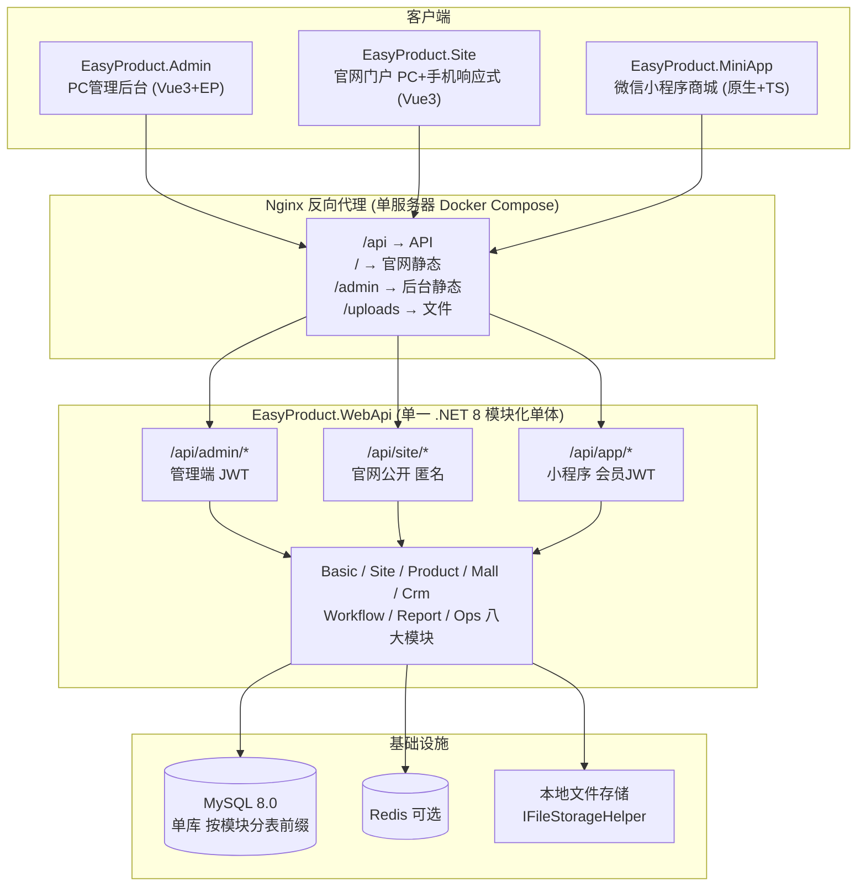
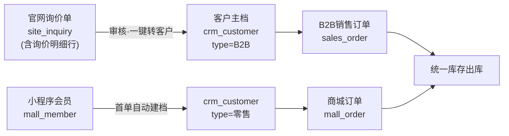

# EasyProduct 统一项目设计方案

> **日期：** 2026-08-08
> **状态：** 已评审通过（用户逐节确认）
> **来源项目：** EasyWebSite（官网）、EasyProject（电商管理系统）、EasyCRM（ERP/CRM 前端）
> **目标：** 将三个项目整合为一个模块化单体项目 EasyProduct，统一后端、统一管理后台，保留官网门户与微信小程序两个独立前端应用。

---

## 1. 背景与现状盘点

### 1.1 三个来源项目

| 项目 | 路径 | 现状 | 技术栈 |
|------|------|------|--------|
| **EasyWebSite** | `D:\4-MyProject\EasyWebSite` | StarryBird B2B 展示官网。前端 `WebSiteNew`（11 个门户页 + 13 个内嵌 admin 页，含登录/仪表盘），后端 `WebSiteNewBack`（独立 JWT 认证） | Vue3 + TS + Element Plus + i18n；.NET 8 + SqlSugar + Autofac + MySQL 8 |
| **EasyProject** | `D:\4-MyProject\EasyProject` | 全栈电商管理系统。后端 `EasyWechatWeb`（实体：Address/Announcement/AntWorkflow/Banner/Basic/Cart/Chat/Coupon/Desktop/Dict/Etl/File/Member/Message/OperateLog/Order/Payment/Product/Screen/Search 等），PC 后台 `PCWeb`，微信小程序 `WeChatWeb`（商城形态），另有 UniAppMobile（**不纳入整合**） | .NET 8 + SqlSugar + Autofac + MySQL + Redis(可选) + JWT 双 Token + Serilog + NPOI + Mapster；Vue3 + TS + Element Plus + Pinia + ECharts + AntV X6；微信原生小程序 + TS |
| **EasyCRM** | `D:\4-MyProject\EasyCRM` | 集团化 ERP/CRM **纯前端**（vite-plugin-mock 驱动，无真实后端）。17 个模块 56 个页面 | Vue3 + TS + Element Plus + ECharts + vue-i18n |

### 1.2 整合关键决策（访谈结论）

| # | 决策点 | 结论 |
|---|--------|------|
| 1 | 整合形态 | **模块化单体**：一个 .NET 8 后端 + 一个 PC 管理后台；官网前端独立但接入统一后端；小程序独立接入统一后端 |
| 2 | CRM 模块取舍 | 保留：工作台、主数据、库存、采购、销售、发票、收付款、应收应付、**固定资产**、冲销；排除：集团组织(org)、财务管理(finance)、财务会计(accounting)、成本核算(cost)；系统设置(sys)并入基础管理 |
| 3 | 主数据归一 | 商品/客户/供应商/库存/冲销各一套；订单双轨（商城订单 + B2B 销售订单并存，共享商品、客户、库存） |
| 4 | 账号体系 | 管理端账号合并为一套（basic_user + RBAC + JWT 双 Token）；小程序会员独立（mall_member）；官网第一期无客户登录（匿名询价，CRM 跟进） |
| 5 | 基础设施 | MySQL 单库 + Redis 可选 + 本地文件存储（暂不用 MinIO，保留 IFileStorageHelper 抽象）+ Serilog；不做 ES/MongoDB/RabbitMQ/IdentityServer |
| 6 | 部署形态 | 单租户 + 单服务器 Docker Compose；不做多租户 |
| 7 | 老数据 | 全新库，不做数据迁移；初始化脚本沿用《部署数据库整理方案》清洗思路 |
| 8 | 命名 | 总项目 EasyProduct；子项目：EasyProduct.WebApi / .Admin / .Site / .MiniApp |
| 9 | 编外模块 | ETL、可视化大屏**均砍掉** |
| - | 小程序范围 | 小程序 = `EasyProject\WeChatWeb`（微信原生商城），UniAppMobile 不纳入 |
| 10 | 多语言 | 三端（Admin/Site/MiniApp）均支持 zh-CN/en-US；语言包按模块拆分 JSON，包内基线 + 远程覆盖（`/api/i18n/{lang}/{module}.json`），文案修改免发布；Admin"语言包管理"页列入二期（`basic_i18n` 表） |

---

## 2. 总体架构



**架构原则：**

- 单体部署、模块边界清晰：业务代码按八大模块分目录，模块间通过接口/服务调用，禁止跨模块直接操作对方数据表（经各自 Service）。
- 三个 API 分区（admin/site/app）共用一个宿主进程，按身份类型隔离认证中间件。
- 继承 EasyProject 既有工程资产：JWT 双 Token、RBAC、SqlSugar 主从配置、IFileStorageHelper 存储抽象、Serilog、定时任务框架、《部署数据库整理方案》。

---

## 3. 仓库目录结构

```text
EasyProduct/
├── EasyProduct.WebApi/                 # 后端解决方案 (.sln)
│   ├── EasyProduct.Web/                # ASP.NET Core 宿主：Controllers/Middleware/Filters/Program.cs
│   ├── EasyProduct.Models/             # 实体/DTO/枚举，按模块子目录
│   ├── EasyProduct.Business/           # 业务层，按模块子目录（见第 4 节）
│   └── EasyProduct.Common/             # 通用组件：Base/Cache/Helper/Options（继承 CommonManager）
├── EasyProduct.Admin/                  # PC 管理后台（以 PCWeb 为骨架）
├── EasyProduct.Site/                   # 官网门户（以 WebSiteNew 为骨架，去掉 admin/ 目录）
├── EasyProduct.MiniApp/                # 微信小程序（以 WeChatWeb 为骨架）
├── sql/                                # 建库脚本 + 初始化种子数据脚本
├── deploy/                             # docker-compose.yml、nginx.conf、Dockerfile
└── docs/                               # 设计文档、开发规范（合并三个项目的 AGENTS.md 精华）
```
---

## 4. 后端八大业务模块（EasyProduct.Business）

| 模块 | 职责 | 来源 |
|------|------|------|
| `Basic` | 用户/部门/角色/菜单/字典/公告/工作台布局/个人中心/系统参数 | EasyProject basic + EasyCRM sys |
| `Site` | 新闻/分类/Banner/关于/下载/视频/询价处理，对官网提供公开 API | WebSiteNewBack 整体迁入 |
| `Product` | **商品中心**：SPU+SKU 主档、渠道发布（官网/小程序/B2B）、商品分类 | 三处商品归一 |
| `Mall` | 会员/购物车/商城订单/支付/优惠券/积分/收藏 | EasyProject buz 电商部分 |
| `Crm` | 主数据/销售订单(B2B)/采购/库存/发票/收付款/应收应付/固定资产/冲销/询价转客户 | EasyCRM 保留的 10 个模块 |
| `Workflow` | AntWorkflow 流程设计器 + 审批中心，挂接业务单据审批 | EasyProject workflow + ant_workflow |
| `Report` | 直连数据源/报表定义/列模板/下钻（ETL 与大屏不做） | EasyProject report |
| `Ops` | 操作日志/登录日志/定时任务/日志查询 | EasyProject ops |

Controller 按 API 分区组织：`Controllers/Admin/**`、`Controllers/Site/**`、`Controllers/App/**`。

---

## 5. 统一账号权限与 API 分区

### 5.1 两类身份，完全隔离

| 身份 | 存储 | 登录方式 | Token |
|------|------|---------|-------|
| **管理端用户** | `basic_user`（继承 EasyProject RBAC：用户/部门/角色/菜单） | 账号+密码 | 双 Token（access+refresh），继承现有机制 |
| **小程序会员** | `mall_member`（继承 WeChatUser：openid 绑定、等级、积分、收藏） | 微信授权登录 | 独立会员 Token |

- 官网原 admin 表作废，其账号迁入 `basic_user`（初始化脚本种入超级管理员）。
- 两类用户永不共表；JWT Claim 中带 `identity_type=admin|member`，中间件校验 API 分区与身份类型匹配，杜绝会员 Token 调管理接口。

### 5.2 API 三分区

| 分区 | 路由前缀 | 认证 | 消费者 |
|------|---------|------|--------|
| 管理端 | `/api/admin/**` | 管理 JWT + 菜单权限校验 | EasyProduct.Admin |
| 官网公开 | `/api/site/**` | 匿名（提交类接口限流） | EasyProduct.Site |
| 小程序 | `/api/app/**` | 会员 JWT | EasyProduct.MiniApp |

### 5.3 权限模型

- 沿用 EasyProject 菜单 RBAC（menu/role/role_menu），菜单表增加"权限标识"字段，采用 EasyCRM 的 `模块:页面:操作` 风格（如 `crm:customer:edit`），支持按钮级控制。
- 初始化种子：超级管理员角色拥有全部菜单；按八大模块预置 8 组默认菜单 + 权限标识。
- 数据权限本期只做**本部门/本人**两档（不做集团多组织数据权限——org 已排除）。

### 5.4 安全基线

- 密码加盐哈希（继承现有实现）；登录失败锁定；登录日志进 Ops。
- 官网询价/联系提交：匿名 + IP 限流 + 后台审核制（Site 模块询价列表）。
- Redis 关闭时双 Token 退化为单 access Token（无刷新、无黑名单），配置开关控制。

---

## 6. 数据模型归一（整合核心）

### 6.1 表命名与库规划

- 单库 `easyproduct`，utf8mb4；表名 = 模块前缀 + snake_case：`basic_` / `site_` / `product_` / `mall_` / `crm_` / `wf_` / `rpt_` / `ops_`。
- 全部表继承 EasyProject 基类字段（Id/创建时间/更新时间/创建人/软删除标记）。

### 6.2 商品中心（product_*）——三处商品归一

| 表 | 说明 |
|----|------|
| `product_category` | 统一分类树（官网/小程序/B2B 共用） |
| `product_spu` | 商品主档：名称/编码/分类/主图/富文本详情/单位/类型(可售票品·物料) |
| `product_sku` | SKU：规格组合/条码/零售价/会员价/B2B价/成本价 |
| `product_channel` | 渠道发布：SPU × 渠道(官网·小程序·B2B) × 上架状态 × 排序 |
| `product_image` | 商品图集 |

> CRM 的"物料"并入 SPU（type=物料，供采购/库存用）；官网产品、商城商品都是 SPU 的渠道发布视图。

### 6.3 客户归一与询价转化



- `crm_customer`：编码/名称/类型(B2B·零售)/来源(询价·注册·建档)/联系人/归属业务员/状态；会员表存 `customer_id` 关联。
- `crm_supplier`：供应商主档，唯一一套。
### 6.4 订单双轨 + 统一库存 + 统一冲销

| 域 | 表 | 要点 |
|----|----|------|
| 商城订单 | `mall_order` / `mall_order_item` | 会员/优惠券/积分/运费/微信支付；状态机：待付款→已付款→发货→完成，可取消/退款 |
| B2B 销售 | `sales_order` / `sales_order_item` | 客户/业务员/成交价/税率/账期；草稿→确认→出库→完成 |
| 采购 | `crm_purchase_order` / `_item` | 供应商/到货→采购入库 |
| 库存 | `crm_warehouse`、`crm_stock`(仓+SKU+可用+锁定)、`crm_stock_record`(流水) | 所有出入库只走一张流水表；来源类型：采购入库/销售出库/商城出库/盘点调整/冲销退回 |
| 盘点预警 | `crm_stock_check`、库存上下限规则→预警记录 | 继承 EasyCRM 页面 |
| 冲销 | `crm_reversal` / `_item` | 统一红冲：商城退款、销售退货、采购退货、单据作废四类；`wf_biz_link` 挂审批 |

### 6.5 业务财务（保留的泛财务模块，轻量登记不记账）

| 表 | 说明 |
|----|------|
| `crm_invoice` | 开票登记（销项/进项、金额、状态），不做税务申报 |
| `crm_payment` | 收款/付款单，关联销售/采购订单，核销 |
| `crm_arap` | 应收应付台账：订单应收 − 已收款 = 余额，账龄分段（30/60/90/90+） |
| `crm_fixed_asset` | 资产卡片：原值/购入日期/折旧方法(直线法)/状态；折旧记录表 `crm_asset_depreciation`，不生成凭证 |

### 6.6 其余模块表

- `site_*`：news / news_category / banner / about(单页) / download / video / inquiry / inquiry_item / contact
- `wf_*`：definition / node / edge / instance / task / history / biz_link（继承 AntWorkflow）
- `mall_*`：member / member_level / points_record / cart / coupon / coupon_receive / favorite
- `rpt_*`：datasource / report / column_template
- `ops_*`：operate_log / login_log / task / task_log
- `basic_*`：user / dept / role / menu / role_menu / user_role / dict_type / dict_data / announcement / layout / setting / i18n（二期语言包管理）

---

## 7. 前端整合方案

### 7.1 EasyProduct.Admin（以 PCWeb 为骨架做加法）

**原样保留**：layout/路由守卫/i18n/Pinia/axios 封装、basic 全套、person 个人中心、ops 运维日志、report 报表、workflow 设计器+审批中心、请假审批（保留为工作流示范业务）。

**迁移整合**：

| 来源 | 去向 | 改造点 |
|------|------|--------|
| EasyCRM 10 个模块页面 | `views/crm/**` | 去掉 mockjs，API 层重写指向 `/api/admin/crm/*`；ECharts 5.5 → 6.x 对齐 |
| EasyCRM dashboard 4 页 | 并入 `desktop` 工作台 | 经营概览/KPI/待办/预警做成工作台内置 Widget，复用 PCWeb Widget 容器 |
| 官网 admin 13 页 | `views/site/**` | 新闻/分类/Banner/关于/下载/视频/询价处理；商品管理改为"商品中心 + 渠道发布"页 |
| buz/product | `views/product/**` 商品中心 | SPU+SKU 编辑、渠道发布开关 |
| buz/customer、buz/supplier | `views/crm/master/**` | 并入 CRM 主数据页，字段以 CRM 模型为准 |
| buz/order | `views/mall/order/**` 商城订单管理 | 与 CRM 销售订单页分开两个菜单 |
| buz/refund | 并入 `views/crm/reversal` 冲销管理 | 商城退款作为冲销类型之一 |
| buz/banner | 并入 `views/site/banner` | 官网 Banner 唯一入口 |

**统一工程化**：所有 API 模块按后端 Swagger 重新生成 TS 类型；菜单按八大模块域重组（见第 9 节）；权限标识 `模块:页面:操作` 接入按钮级控制。

### 7.2 EasyProduct.Site（以 WebSiteNew 为骨架做减法）

- 删除 `src/views/admin/` 全部 13 个页面及其路由（含 admin 登录/仪表盘，仪表盘职能并入统一工作台） → 管理职能全部进 Admin 后台。
- 保留 11 个门户页（首页/产品/产品详情/新闻/新闻详情/视频/下载/关于/联系/询价/404），PC+手机响应式、中英文 i18n 不动。
- API base 从 WebSiteNewBack 改指 `/api/site/*`（契约基本不变，改 URL 前缀 + 字段对齐）；保留 mock 开关供前端独立开发。
- 询价篮提交 → 落 `site_inquiry`（含明细行），后台 Admin 询价列表处理并可一键转客户。

### 7.3 EasyProduct.MiniApp（以 WeChatWeb 为骨架换数据源）

- 页面全部保留（首页/分类/详情/购物车/下单/支付/我的/客服聊天）。
- `adapters/` 数据适配层从 mock 切换为真实 `/api/app/*` API；商品数据源 = `product_channel` 渠道=小程序。
- 微信登录：`wx.login` code → 后端 code2session → 会员 JWT。
- 支付：接入微信支付 JSAPI（继承 EasyProject Payment 模块骨架）。

---

## 8. 基础设施与部署

### 8.1 基础设施栈（做减法）

| 组件 | 决策 | 理由 |
|------|------|------|
| MySQL 8.0 | 唯一数据库，单库分模块表前缀 | 三个项目本来都用 MySQL |
| Redis | 可选组件（缓存/验证码/Token 黑名单），配置开关 | EasyProject 已在用，可关闭 |
| 文件存储 | 本地存储为默认（暂不用 MinIO），保留 `IFileStorageHelper` 抽象 | 继承现有实现，将来可切换 |
| ES / MongoDB / RabbitMQ / IdentityServer | 均不做 | 单体规模不需要；JWT 够用；日志用 Serilog + MySQL |
| 日志/运维 | Serilog + Ops 模块（操作/登录/任务日志） | 继承 |

### 8.2 Docker Compose（单服务器）

```yaml
services:
  nginx:    # SSL 终结；/ → Site静态，/admin → Admin静态，/api → api:8080，/uploads → 文件卷
  api:      # EasyProduct.Web 多阶段构建镜像
  mysql:    # 8.0，卷持久化，/docker-entrypoint-initdb.d 挂 sql/ 初始化脚本
  redis:    # 可选，compose 里注释即关（后端 RedisEnabled 开关自适应）
volumes:    # mysql_data、uploads（本地文件存储目录）
```

- 单域名方案：`https://example.com`；小程序合法域名直接配置该域名。
- 发布流程：前端各自 `build` 出 dist → 挂进 nginx；后端 `dotnet publish` → Docker 镜像。
---

## 9. Admin 后台菜单树（八大域）

```text
工作台          经营概览·KPI·待办·预警（Widget 化）
基础管理        用户·部门·角色·菜单·字典·公告·工作台布局·系统参数·个人中心
商品中心        商品分类·商品管理(SPU+SKU)·渠道发布
官网管理        新闻·分类·Banner·视频·下载·关于·询价处理·留言
商城业务        会员·等级·积分·优惠券·商城订单·支付记录
CRM            主数据(客户·供应商·币种·税率)│销售订单│采购订单│
               库存(仓库·库存·出入库·盘点·预警)│发票·收付款·应收应付·固定资产·冲销
工作流          流程设计·发布·我的申请·待我审批·已办·实例查询
报表管理        数据源·报表定义·列模板
运维日志        操作日志·登录日志·定时任务·任务日志·日志查询
```

---

## 10. 开发阶段规划（每阶段独立可演示）

| 阶段 | 内容 | 产出 |
|------|------|------|
| **P0 脚手架** | 仓库结构、sln、空宿主、统一认证骨架、docker-compose 空壳 | 能跑通 /health |
| **P1 基础平台** | Basic 全模块迁移 + Ops 日志 + Admin 骨架整合 + 建库/种子脚本 | 可登录的后台 |
| **P2 商品+官网线** | 商品中心、Site 模块、Site 前端接入、询价→转客户 | 官网上线形态 |
| **P3 商城线** | 会员/购物车/订单/支付/优惠券/积分 + MiniApp 接入 + 冲销 | 小程序可下单 |
| **P4 CRM 线** | 主数据/销售/采购/库存/发票/收付款/应收应付/固定资产/冲销 | B2B 全流程 |
| **P5 工作流+报表+工作台** | 单据挂审批、报表迁移、工作台 Widget 整合、语言包管理页（二期项） | 全功能 |
| **P6 联调发布** | 全链路走查、初始化脚本冻结、文档合并、部署上线 | 1.0 |

> 每个阶段进场前再用 writing-plans 拆细步骤，避免单次任务过大（沿用 EasyProject AGENTS.md 的约定）。

---

## 11. YAGNI 边界与风险

### 11.1 明确不做

多租户 ❌ 集团多组织 ❌ 财务记账/成本核算 ❌ ETL ❌ 可视化大屏 ❌ ES/MongoDB/RabbitMQ/IdentityServer ❌ 老数据迁移 ❌ MinIO（暂）❌ 官网客户登录（一期）❌ UniAppMobile ❌

### 11.2 已知风险

1. **EasyCRM 页面全靠 mock 驱动，API 契约未定** → 以本设计第 6 节数据模型为契约基准，页面适配后端。
2. **微信支付需商户号、小程序上架需类目资质** → 非技术阻塞项，P3 阶段前需落实资质。
3. **三个项目的代码风格/依赖版本存在差异**（如 ECharts 5.5 vs 6.x、Element Plus 版本）→ P1 阶段统一依赖版本清单。

---

## 12. 测试策略（轻量）

- **后端**：Swagger 全接口手工冒烟 + 对**库存流水、冲销、收付款核销**写 xUnit 单元测试（这三处涉及钱和账，必须有测试）。
- **前端**：三端各一份《页面走查清单》（docs/），发版前逐项打勾。
- **联调**：P6 阶段全链路走查（官网询价→转客户→B2B 下单→出库→收款核销；小程序下单→支付→出库→退款冲销）。

---

## 附录 A：源项目资产处置总表

| 源资产 | 处置 |
|--------|------|
| WebSiteNew 门户 11 页 | → EasyProduct.Site |
| WebSiteNew admin 13 页 | → EasyProduct.Admin `views/site/**` |
| WebSiteNewBack 全部控制器 | → 后端 Site 模块（`/api/site/**` + `/api/admin/site/**`），独立后端作废 |
| EasyWechatWeb Basic/Ops/AntWorkflow/Report | → 后端对应模块（去掉 Etl、Screen 相关） |
| EasyWechatWeb buz | 商品/客户/供应商/订单/退款/Banner → Product/Mall/Crm/Site 模块；请假审批(leave)保留为 Workflow 示范业务 |
| PCWeb | → EasyProduct.Admin 骨架 |
| WeChatWeb | → EasyProduct.MiniApp |
| EasyCRM web 保留的 10 模块页面 | → EasyProduct.Admin `views/crm/**` + 工作台 Widget |
| EasyCRM web org/finance/accounting/cost | ❌ 丢弃 |
| EasyProject UniAppMobile | ❌ 不纳入 |
| EasyProject ETL、可视化大屏 | ❌ 丢弃 |
| IFileStorageHelper、JWT 双 Token、RBAC、定时任务、部署数据库整理方案 | ✅ 直接继承 |