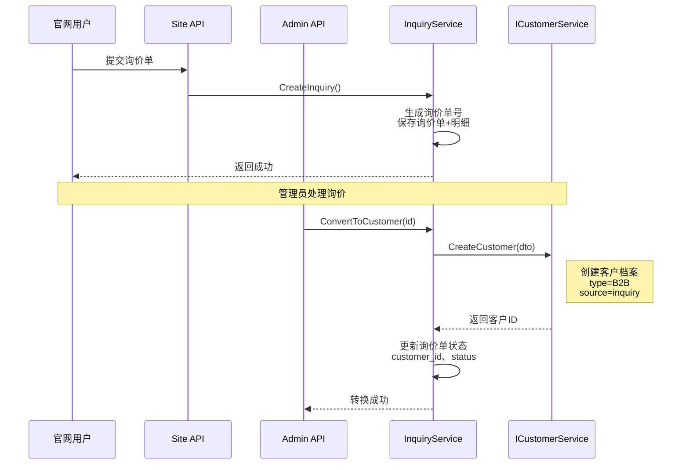

# Site 官网管理模块后端设计方案

> **日期：** 2026-09-11
> **状态：** 已评审通过
> **批次：** 分 3 个批次开发
> **预计时间：** 8-11 天

---

## 1. 背景与目标

### 1.1 背景

EasyProduct 项目整合了三个来源项目（EasyWebSite、EasyProject、EasyCRM），其中 Site 模块负责官网内容管理功能。目前 Site 模块的数据表已在 `sql/init-database.sql` 中定义，但缺少：

- 实体类（Entitys）
- 数据传输对象（DTO）
- 业务服务层（Service）
- 控制器层（Controller）
- Mock 数据（部分需要）

### 1.2 目标

完成 Site 模块的 7 个核心功能开发：

1. **新闻管理**：新闻分类 + 新闻列表，支持中英文、置顶、浏览次数
2. **Banner 管理**：Banner 列表，支持位置、有效期、排序
3. **关于我们**：单页内容管理，支持中英文
4. **下载管理**：文件下载列表，支持分类、下载次数
5. **视频管理**：视频列表，支持封面图、播放次数
6. **询价管理**：询价单 + 明细行，支持询价转客户
7. **留言管理**：留言列表，支持状态管理

### 1.3 关键需求

- **询价转客户**：询价单可一键转为 B2B 客户档案
- **限流保护**：询价、留言提交接口需要 IP 限流
- **分区分权**：管理端 API 需要 JWT + 权限标识，官网公开 API 匿名访问
- **多语言支持**：所有内容支持中英文双语

---

## 2. 总体架构

### 2.1 架构图

```mermaid
graph TB
    subgraph Admin["Admin 管理端 (/api/admin/site/*)"]
        AC1[NewsController]
        AC2[BannerController]
        AC3[AboutController]
        AC4[DownloadController]
        AC5[VideoController]
        AC6[InquiryController]
        AC7[ContactController]
    end

    subgraph SiteAPI["Site 官网公开 (/api/site/*)"]
        SC1[NewsController]
        SC2[BannerController]
        SC3[AboutController]
        SC4[DownloadController]
        SC5[VideoController]
        SC6[InquiryController<br/>需要限流]
        SC7[ContactController<br/>需要限流]
    end

    subgraph Services["业务服务层"]
        AS1[NewsService<br/>管理端]
        AS2[BannerService<br/>管理端]
        AS3[AboutService<br/>管理端]
        AS4[DownloadService<br/>管理端]
        AS5[VideoService<br/>管理端]
        AS6[InquiryService<br/>管理端]
        AS7[ContactService<br/>管理端]
        
        SS1[SiteNewsService<br/>官网公开]
        SS2[SiteBannerService<br/>官网公开]
        SS3[SiteAboutService<br/>官网公开]
        SS4[SiteDownloadService<br/>官网公开]
        SS5[SiteVideoService<br/>官网公开]
        SS6[SiteInquiryService<br/>官网公开]
        SS7[SiteContactService<br/>官网公开]
    end

    subgraph Models["数据模型层"]
        E1[site_news<br/>site_news_category]
        E2[site_banner]
        E3[site_about]
        E4[site_download]
        E5[site_video]
        E6[site_inquiry<br/>site_inquiry_item]
        E7[site_contact]
    end

    AC1 --> AS1 --> E1
    AC2 --> AS2 --> E2
    AC3 --> AS3 --> E3
    AC4 --> AS4 --> E4
    AC5 --> AS5 --> E5
    AC6 --> AS6 --> E6
    AC7 --> AS7 --> E7

    SC1 --> SS1 --> E1
    SC2 --> SS2 --> E2
    SC3 --> SS3 --> E3
    SC4 --> SS4 --> E4
    SC5 --> SS5 --> E5
    SC6 --> SS6 --> E6
    SC7 --> SS7 --> E7

    AS6 -.询价转客户.-> CRM[ICustomerService<br/>CRM 模块]
```



### 2.2 技术选型

| 技术点 | 选型 | 说明 |
|--------|------|------|
| ORM | SqlSugar | 继承项目基线 |
| 对象映射 | Mapster | 继承项目基线 |
| 依赖注入 | Autofac + 构造器注入 | 继承项目基线 |
| 日志 | Serilog | 继承项目基线 |
| 限流 | ASP.NET Core Rate Limiting | 用于询价/留言提交接口 |
| 权限 | JWT + 权限标识 | Admin 需要，Site 公开 |

### 2.3 设计原则

#### 分离 Service + 分离 Controller

每个功能提供两个独立的 Service 和 Controller：

- **管理端**：`NewsService` + `Admin/Site/NewsController`，需要权限控制
- **官网公开**：`SiteNewsService` + `Site/NewsController`，匿名访问

**优点：**
- 逻辑独立，易于维护
- 权限边界清晰
- 可以针对不同场景优化

#### 混合状态枚举策略

- **简单内容**（新闻、Banner、视频、下载、关于）：使用通用 `Status` 枚举
- **复杂业务**（询价、留言）：创建专用状态枚举（`InquiryStatus`、`ContactStatus`）

---

## 3. 目录结构

```text
EasyProduct.WebApi/
├── EasyProduct.Models/
│   ├── Entitys/Site/                    # Site 模块实体
│   │   ├── site_news.cs
│   │   ├── site_news_category.cs
│   │   ├── site_banner.cs
│   │   ├── site_about.cs
│   │   ├── site_download.cs
│   │   ├── site_video.cs
│   │   ├── site_inquiry.cs
│   │   ├── site_inquiry_item.cs
│   │   └── site_contact.cs
│   ├── Dto/Site/                        # Site 模块 DTO
│   │   ├── News/
│   │   │   ├── NewsDto.cs
│   │   │   ├── NewsQueryDto.cs
│   │   │   ├── CreateNewsDto.cs
│   │   │   └── UpdateNewsDto.cs
│   │   ├── NewsCategory/
│   │   ├── Banner/
│   │   ├── About/
│   │   ├── Download/
│   │   ├── Video/
│   │   ├── Inquiry/
│   │   └── Contact/
│   └── Enums/Site/                      # Site 模块枚举
│       ├── InquiryStatus.cs             # 询价状态
│       └── ContactStatus.cs             # 留言状态
│
├── EasyProduct.Business/Site/           # Site 模块服务
│   ├── INewsCategoryService.cs
│   ├── NewsCategoryService.cs           # 管理端
│   ├── INewsService.cs
│   ├── NewsService.cs                   # 管理端
│   ├── ISiteNewsService.cs
│   ├── SiteNewsService.cs               # 官网公开
│   ├── ... (其他服务)
│
└── EasyProduct.Web/Controllers/
    ├── Admin/Site/                      # 管理端控制器
    │   ├── NewsCategoryController.cs
    │   ├── NewsController.cs
    │   ├── BannerController.cs
    │   ├── AboutController.cs
    │   ├── DownloadController.cs
    │   ├── VideoController.cs
    │   ├── InquiryController.cs
    │   └── ContactController.cs
    └── Site/                            # 官网公开控制器
        ├── NewsController.cs
        ├── BannerController.cs
        ├── AboutController.cs
        ├── DownloadController.cs
        ├── VideoController.cs
        ├── InquiryController.cs
        └── ContactController.cs

mock-server/
├── data/site/
│   └── news.js                          # 新闻和 Banner mock 数据
└── routes/site.js                       # Site 模块 mock 路由
```

---

## 4. 数据模型设计

### 4.1 数据库表结构

#### 4.1.1 新闻分类表 (site_news_category)

```sql
DROP TABLE IF EXISTS `site_news_category`;
CREATE TABLE `site_news_category` (
  `id` CHAR(36) NOT NULL COMMENT '主键ID',
  `category_name` VARCHAR(100) NOT NULL COMMENT '分类名称',
  `category_code` VARCHAR(50) DEFAULT NULL COMMENT '分类编码',
  `sort` INT DEFAULT 0 COMMENT '排序',
  `status` INT DEFAULT 1 COMMENT '状态：0=禁用，1=启用',
  `create_time` DATETIME NOT NULL DEFAULT CURRENT_TIMESTAMP COMMENT '创建时间',
  `update_time` DATETIME NOT NULL DEFAULT CURRENT_TIMESTAMP ON UPDATE CURRENT_TIMESTAMP COMMENT '更新时间',
  `create_by` VARCHAR(50) DEFAULT NULL COMMENT '创建人',
  `is_deleted` TINYINT(1) DEFAULT 0 COMMENT '软删除标记：0=未删除，1=已删除',
  PRIMARY KEY (`id`),
  KEY `idx_sort` (`sort`),
  KEY `idx_status` (`status`),
  KEY `idx_is_deleted` (`is_deleted`)
) ENGINE=InnoDB DEFAULT CHARSET=utf8mb4 COMMENT='新闻分类表';
```

#### 4.1.2 新闻表 (site_news)

```sql
DROP TABLE IF EXISTS `site_news`;
CREATE TABLE `site_news` (
  `id` CHAR(36) NOT NULL COMMENT '主键ID',
  `category_id` CHAR(36) DEFAULT NULL COMMENT '分类ID',
  `title` VARCHAR(200) NOT NULL COMMENT '新闻标题',
  `title_en` VARCHAR(200) DEFAULT NULL COMMENT '新闻标题（英文）',
  `summary` VARCHAR(500) DEFAULT NULL COMMENT '摘要',
  `summary_en` VARCHAR(500) DEFAULT NULL COMMENT '摘要（英文）',
  `content` LONGTEXT COMMENT '内容（富文本）',
  `content_en` LONGTEXT COMMENT '内容（英文，富文本）',
  `cover_image` VARCHAR(500) DEFAULT NULL COMMENT '封面图片URL',
  `author` VARCHAR(50) DEFAULT NULL COMMENT '作者',
  `source` VARCHAR(100) DEFAULT NULL COMMENT '来源',
  `view_count` INT DEFAULT 0 COMMENT '浏览次数',
  `is_top` INT DEFAULT 0 COMMENT '是否置顶：0=否，1=是',
  `publish_time` DATETIME DEFAULT NULL COMMENT '发布时间',
  `status` INT DEFAULT 1 COMMENT '状态：0=禁用，1=启用',
  `create_time` DATETIME NOT NULL DEFAULT CURRENT_TIMESTAMP COMMENT '创建时间',
  `update_time` DATETIME NOT NULL DEFAULT CURRENT_TIMESTAMP ON UPDATE CURRENT_TIMESTAMP COMMENT '更新时间',
  `create_by` VARCHAR(50) DEFAULT NULL COMMENT '创建人',
  `is_deleted` TINYINT(1) DEFAULT 0 COMMENT '软删除标记：0=未删除，1=已删除',
  PRIMARY KEY (`id`),
  KEY `idx_category_id` (`category_id`),
  KEY `idx_status` (`status`),
  KEY `idx_is_top` (`is_top`),
  KEY `idx_publish_time` (`publish_time`),
  KEY `idx_is_deleted` (`is_deleted`)
) ENGINE=InnoDB DEFAULT CHARSET=utf8mb4 COMMENT='新闻表';
```

#### 4.1.3 Banner 表 (site_banner)

```sql
DROP TABLE IF EXISTS `site_banner`;
CREATE TABLE `site_banner` (
  `id` CHAR(36) NOT NULL COMMENT '主键ID',
  `title` VARCHAR(100) DEFAULT NULL COMMENT 'Banner标题',
  `title_en` VARCHAR(100) DEFAULT NULL COMMENT 'Banner标题（英文）',
  `image_url` VARCHAR(500) NOT NULL COMMENT '图片URL',
  `link_url` VARCHAR(500) DEFAULT NULL COMMENT '跳转链接',
  `target` VARCHAR(10) DEFAULT '_self' COMMENT '打开方式：_self/_blank',
  `position` VARCHAR(50) DEFAULT 'home' COMMENT '位置：home=首页，product=产品页等',
  `sort` INT DEFAULT 0 COMMENT '排序',
  `status` INT DEFAULT 1 COMMENT '状态：0=禁用，1=启用',
  `start_time` DATETIME DEFAULT NULL COMMENT '开始时间',
  `end_time` DATETIME DEFAULT NULL COMMENT '结束时间',
  `create_time` DATETIME NOT NULL DEFAULT CURRENT_TIMESTAMP COMMENT '创建时间',
  `update_time` DATETIME NOT NULL DEFAULT CURRENT_TIMESTAMP ON UPDATE CURRENT_TIMESTAMP COMMENT '更新时间',
  `create_by` VARCHAR(50) DEFAULT NULL COMMENT '创建人',
  `is_deleted` TINYINT(1) DEFAULT 0 COMMENT '软删除标记：0=未删除，1=已删除',
  PRIMARY KEY (`id`),
  KEY `idx_position` (`position`),
  KEY `idx_sort` (`sort`),
  KEY `idx_status` (`status`),
  KEY `idx_time_range` (`start_time`, `end_time`),
  KEY `idx_is_deleted` (`is_deleted`)
) ENGINE=InnoDB DEFAULT CHARSET=utf8mb4 COMMENT='Banner表';
```

#### 4.1.4 关于我们表 (site_about)

```sql
DROP TABLE IF EXISTS `site_about`;
CREATE TABLE `site_about` (
  `id` CHAR(36) NOT NULL COMMENT '主键ID',
  `title` VARCHAR(200) DEFAULT '关于我们' COMMENT '标题',
  `title_en` VARCHAR(200) DEFAULT 'About Us' COMMENT '标题（英文）',
  `content` LONGTEXT COMMENT '内容（富文本）',
  `content_en` LONGTEXT COMMENT '内容（英文，富文本）',
  `status` INT DEFAULT 1 COMMENT '状态：0=禁用，1=启用',
  `create_time` DATETIME NOT NULL DEFAULT CURRENT_TIMESTAMP COMMENT '创建时间',
  `update_time` DATETIME NOT NULL DEFAULT CURRENT_TIMESTAMP ON UPDATE CURRENT_TIMESTAMP COMMENT '更新时间',
  `create_by` VARCHAR(50) DEFAULT NULL COMMENT '创建人',
  `is_deleted` TINYINT(1) DEFAULT 0 COMMENT '软删除标记：0=未删除，1=已删除',
  PRIMARY KEY (`id`)
) ENGINE=InnoDB DEFAULT CHARSET=utf8mb4 COMMENT='关于我们表';
```

#### 4.1.5 下载管理表 (site_download)

```sql
DROP TABLE IF EXISTS `site_download`;
CREATE TABLE `site_download` (
  `id` CHAR(36) NOT NULL COMMENT '主键ID',
  `category` VARCHAR(50) DEFAULT NULL COMMENT '分类',
  `title` VARCHAR(200) NOT NULL COMMENT '标题',
  `title_en` VARCHAR(200) DEFAULT NULL COMMENT '标题（英文）',
  `description` VARCHAR(500) DEFAULT NULL COMMENT '描述',
  `description_en` VARCHAR(500) DEFAULT NULL COMMENT '描述（英文）',
  `file_url` VARCHAR(500) NOT NULL COMMENT '文件URL',
  `file_name` VARCHAR(200) DEFAULT NULL COMMENT '文件名称',
  `file_size` INT DEFAULT NULL COMMENT '文件大小（字节）',
  `file_type` VARCHAR(50) DEFAULT NULL COMMENT '文件类型（pdf/doc/xls等）',
  `download_count` INT DEFAULT 0 COMMENT '下载次数',
  `sort` INT DEFAULT 0 COMMENT '排序',
  `status` INT DEFAULT 1 COMMENT '状态：0=禁用，1=启用',
  `create_time` DATETIME NOT NULL DEFAULT CURRENT_TIMESTAMP COMMENT '创建时间',
  `update_time` DATETIME NOT NULL DEFAULT CURRENT_TIMESTAMP ON UPDATE CURRENT_TIMESTAMP COMMENT '更新时间',
  `create_by` VARCHAR(50) DEFAULT NULL COMMENT '创建人',
  `is_deleted` TINYINT(1) DEFAULT 0 COMMENT '软删除标记：0=未删除，1=已删除',
  PRIMARY KEY (`id`),
  KEY `idx_category` (`category`),
  KEY `idx_status` (`status`),
  KEY `idx_is_deleted` (`is_deleted`)
) ENGINE=InnoDB DEFAULT CHARSET=utf8mb4 COMMENT='下载管理表';
```

#### 4.1.6 视频管理表 (site_video)

```sql
DROP TABLE IF EXISTS `site_video`;
CREATE TABLE `site_video` (
  `id` CHAR(36) NOT NULL COMMENT '主键ID',
  `title` VARCHAR(200) NOT NULL COMMENT '标题',
  `title_en` VARCHAR(200) DEFAULT NULL COMMENT '标题（英文）',
  `description` VARCHAR(500) DEFAULT NULL COMMENT '描述',
  `description_en` VARCHAR(500) DEFAULT NULL COMMENT '描述（英文）',
  `video_url` VARCHAR(500) NOT NULL COMMENT '视频URL',
  `cover_image` VARCHAR(500) DEFAULT NULL COMMENT '封面图URL',
  `duration` INT DEFAULT NULL COMMENT '时长（秒）',
  `view_count` INT DEFAULT 0 COMMENT '播放次数',
  `sort` INT DEFAULT 0 COMMENT '排序',
  `status` INT DEFAULT 1 COMMENT '状态：0=禁用，1=启用',
  `create_time` DATETIME NOT NULL DEFAULT CURRENT_TIMESTAMP COMMENT '创建时间',
  `update_time` DATETIME NOT NULL DEFAULT CURRENT_TIMESTAMP ON UPDATE CURRENT_TIMESTAMP COMMENT '更新时间',
  `create_by` VARCHAR(50) DEFAULT NULL COMMENT '创建人',
  `is_deleted` TINYINT(1) DEFAULT 0 COMMENT '软删除标记：0=未删除，1=已删除',
  PRIMARY KEY (`id`),
  KEY `idx_status` (`status`),
  KEY `idx_is_deleted` (`is_deleted`)
) ENGINE=InnoDB DEFAULT CHARSET=utf8mb4 COMMENT='视频管理表';
```

#### 4.1.7 询价单表 (site_inquiry)

```sql
DROP TABLE IF EXISTS `site_inquiry`;
CREATE TABLE `site_inquiry` (
  `id` CHAR(36) NOT NULL COMMENT '主键ID',
  `inquiry_no` VARCHAR(50) NOT NULL COMMENT '询价单号',
  `company_name` VARCHAR(200) DEFAULT NULL COMMENT '公司名称',
  `contact_name` VARCHAR(100) NOT NULL COMMENT '联系人',
  `phone` VARCHAR(50) DEFAULT NULL COMMENT '电话',
  `email` VARCHAR(100) DEFAULT NULL COMMENT '邮箱',
  `country` VARCHAR(50) DEFAULT NULL COMMENT '国家',
  `province` VARCHAR(50) DEFAULT NULL COMMENT '省份',
  `city` VARCHAR(50) DEFAULT NULL COMMENT '城市',
  `address` VARCHAR(500) DEFAULT NULL COMMENT '详细地址',
  `remark` TEXT COMMENT '备注',
  `status` INT DEFAULT 0 COMMENT '状态：0=待处理，1=已跟进，2=已转客户，3=已关闭',
  `customer_id` CHAR(36) DEFAULT NULL COMMENT '转客户后的客户ID',
  `follow_user_id` CHAR(36) DEFAULT NULL COMMENT '跟进人ID',
  `follow_time` DATETIME DEFAULT NULL COMMENT '跟进时间',
  `follow_remark` TEXT COMMENT '跟进备注',
  `ip` VARCHAR(50) DEFAULT NULL COMMENT '提交IP',
  `user_agent` VARCHAR(500) DEFAULT NULL COMMENT '浏览器信息',
  `create_time` DATETIME NOT NULL DEFAULT CURRENT_TIMESTAMP COMMENT '创建时间',
  `update_time` DATETIME NOT NULL DEFAULT CURRENT_TIMESTAMP ON UPDATE CURRENT_TIMESTAMP COMMENT '更新时间',
  `is_deleted` TINYINT(1) DEFAULT 0 COMMENT '软删除标记：0=未删除，1=已删除',
  PRIMARY KEY (`id`),
  UNIQUE KEY `uk_inquiry_no` (`inquiry_no`),
  KEY `idx_status` (`status`),
  KEY `idx_customer_id` (`customer_id`),
  KEY `idx_create_time` (`create_time`),
  KEY `idx_is_deleted` (`is_deleted`)
) ENGINE=InnoDB DEFAULT CHARSET=utf8mb4 COMMENT='询价单表';
```

#### 4.1.8 询价明细表 (site_inquiry_item)

```sql
DROP TABLE IF EXISTS `site_inquiry_item`;
CREATE TABLE `site_inquiry_item` (
  `id` CHAR(36) NOT NULL COMMENT '主键ID',
  `inquiry_id` CHAR(36) NOT NULL COMMENT '询价单ID',
  `product_name` VARCHAR(200) NOT NULL COMMENT '产品名称',
  `product_code` VARCHAR(50) DEFAULT NULL COMMENT '产品编码',
  `quantity` INT DEFAULT NULL COMMENT '数量',
  `unit` VARCHAR(20) DEFAULT NULL COMMENT '单位',
  `remark` VARCHAR(500) DEFAULT NULL COMMENT '备注',
  `sort` INT DEFAULT 0 COMMENT '排序',
  `create_time` DATETIME NOT NULL DEFAULT CURRENT_TIMESTAMP COMMENT '创建时间',
  `update_time` DATETIME NOT NULL DEFAULT CURRENT_TIMESTAMP ON UPDATE CURRENT_TIMESTAMP COMMENT '更新时间',
  `is_deleted` TINYINT(1) DEFAULT 0 COMMENT '软删除标记：0=未删除，1=已删除',
  PRIMARY KEY (`id`),
  KEY `idx_inquiry_id` (`inquiry_id`),
  KEY `idx_is_deleted` (`is_deleted`)
) ENGINE=InnoDB DEFAULT CHARSET=utf8mb4 COMMENT='询价明细表';
```

#### 4.1.9 留言表 (site_contact)

```sql
DROP TABLE IF EXISTS `site_contact`;
CREATE TABLE `site_contact` (
  `id` CHAR(36) NOT NULL COMMENT '主键ID',
  `name` VARCHAR(100) NOT NULL COMMENT '姓名',
  `phone` VARCHAR(50) DEFAULT NULL COMMENT '电话',
  `email` VARCHAR(100) DEFAULT NULL COMMENT '邮箱',
  `company` VARCHAR(200) DEFAULT NULL COMMENT '公司',
  `subject` VARCHAR(200) DEFAULT NULL COMMENT '主题',
  `message` TEXT NOT NULL COMMENT '留言内容',
  `status` INT DEFAULT 0 COMMENT '状态：0=未读，1=已读，2=已回复',
  `reply` TEXT COMMENT '回复内容',
  `reply_time` DATETIME DEFAULT NULL COMMENT '回复时间',
  `reply_user_id` CHAR(36) DEFAULT NULL COMMENT '回复人ID',
  `ip` VARCHAR(50) DEFAULT NULL COMMENT '提交IP',
  `user_agent` VARCHAR(500) DEFAULT NULL COMMENT '浏览器信息',
  `create_time` DATETIME NOT NULL DEFAULT CURRENT_TIMESTAMP COMMENT '创建时间',
  `update_time` DATETIME NOT NULL DEFAULT CURRENT_TIMESTAMP ON UPDATE CURRENT_TIMESTAMP COMMENT '更新时间',
  `is_deleted` TINYINT(1) DEFAULT 0 COMMENT '软删除标记：0=未删除，1=已删除',
  PRIMARY KEY (`id`),
  KEY `idx_status` (`status`),
  KEY `idx_create_time` (`create_time`),
  KEY `idx_is_deleted` (`is_deleted`)
) ENGINE=InnoDB DEFAULT CHARSET=utf8mb4 COMMENT='留言表';
```

### 4.2 状态枚举设计

#### 4.2.1 询价状态枚举

```csharp
// EasyProduct.Models/Enums/Site/InquiryStatus.cs
namespace EasyProduct.Models.Enums.Site;

/// <summary>
/// 询价状态枚举
/// </summary>
public enum InquiryStatus
{
    /// <summary>待处理</summary>
    Pending = 0,
    
    /// <summary>已跟进</summary>
    Followed = 1,
    
    /// <summary>已转客户</summary>
    Converted = 2,
    
    /// <summary>已关闭</summary>
    Closed = 3
}
```

#### 4.2.2 留言状态枚举

```csharp
// EasyProduct.Models/Enums/Site/ContactStatus.cs
namespace EasyProduct.Models.Enums.Site;

/// <summary>
/// 留言状态枚举
/// </summary>
public enum ContactStatus
{
    /// <summary>未读</summary>
    Unread = 0,
    
    /// <summary>已读</summary>
    Read = 1,
    
    /// <summary>已回复</summary>
    Replied = 2
}
```

---

## 5. API 设计

### 5.1 API 路由规范

#### 管理端 API

| 功能 | 路由前缀 | 认证 | 权限标识前缀 |
|------|---------|------|-------------|
| 新闻分类 | `/api/admin/site/news-category` | AdminJwt | `site:news-category:` |
| 新闻 | `/api/admin/site/news` | AdminJwt | `site:news:` |
| Banner | `/api/admin/site/banner` | AdminJwt | `site:banner:` |
| 关于我们 | `/api/admin/site/about` | AdminJwt | `site:about:` |
| 下载 | `/api/admin/site/download` | AdminJwt | `site:download:` |
| 视频 | `/api/admin/site/video` | AdminJwt | `site:video:` |
| 询价 | `/api/admin/site/inquiry` | AdminJwt | `site:inquiry:` |
| 留言 | `/api/admin/site/contact` | AdminJwt | `site:contact:` |

#### 官网公开 API

| 功能 | 路由前缀 | 认证 | 限流 |
|------|---------|------|------|
| 新闻 | `/api/site/news` | 匿名 | 否 |
| Banner | `/api/site/banner` | 匿名 | 否 |
| 关于我们 | `/api/site/about` | 匿名 | 否 |
| 下载 | `/api/site/download` | 匿名 | 否 |
| 视频 | `/api/site/video` | 匿名 | 否 |
| 询价 | `/api/site/inquiry` | 匿名 | **是（10次/分钟/IP）** |
| 留言 | `/api/site/contact` | 匿名 | **是（10次/分钟/IP）** |

### 5.2 批次 1 API 详细设计

#### 5.2.1 新闻分类 API

**管理端：**

```
GET    /api/admin/site/news-category/list     分页查询新闻分类列表
GET    /api/admin/site/news-category/all      获取所有启用的新闻分类
GET    /api/admin/site/news-category/{id}     获取新闻分类详情
POST   /api/admin/site/news-category          创建新闻分类
PUT    /api/admin/site/news-category/{id}     更新新闻分类
DELETE /api/admin/site/news-category/{id}     删除新闻分类
```

**官网公开：**

```
GET    /api/site/news/categories              获取所有新闻分类
```

#### 5.2.2 新闻 API

**管理端：**

```
GET    /api/admin/site/news/list              分页查询新闻列表
GET    /api/admin/site/news/{id}              获取新闻详情
POST   /api/admin/site/news                   创建新闻
PUT    /api/admin/site/news/{id}              更新新闻
DELETE /api/admin/site/news/{id}              删除新闻
POST   /api/admin/site/news/batch-delete      批量删除新闻
PUT    /api/admin/site/news/{id}/status       更新新闻状态
PUT    /api/admin/site/news/{id}/top          设置/取消置顶
```

**官网公开：**

```
GET    /api/site/news/list                    分页查询新闻列表（只返回已发布）
GET    /api/site/news/{id}                    获取新闻详情（增加浏览次数）
GET    /api/site/news/recommended             获取推荐新闻
```

#### 5.2.3 Banner API

**管理端：**

```
GET    /api/admin/site/banner/list            分页查询Banner列表
GET    /api/admin/site/banner/{id}            获取Banner详情
POST   /api/admin/site/banner                 创建Banner
PUT    /api/admin/site/banner/{id}            更新Banner
DELETE /api/admin/site/banner/{id}            删除Banner
POST   /api/admin/site/banner/batch-delete    批量删除Banner
PUT    /api/admin/site/banner/{id}/status     更新Banner状态
```

**官网公开：**

```
GET    /api/site/banner/{position}            根据位置获取Banner列表
```

### 5.3 批次 2 API 详细设计

#### 5.3.1 关于我们 API

**管理端：**

```
GET    /api/admin/site/about                  获取关于我们
PUT    /api/admin/site/about                  更新关于我们
```

**官网公开：**

```
GET    /api/site/about                        获取关于我们
```

#### 5.3.2 下载管理 API

**管理端：**

```
GET    /api/admin/site/download/list          分页查询下载列表
GET    /api/admin/site/download/{id}          获取下载详情
POST   /api/admin/site/download               创建下载
PUT    /api/admin/site/download/{id}          更新下载
DELETE /api/admin/site/download/{id}          删除下载
POST   /api/admin/site/download/batch-delete  批量删除
```

**官网公开：**

```
GET    /api/site/download/list                分页查询下载列表
GET    /api/site/download/{id}                获取下载详情（增加下载次数）
```

#### 5.3.3 视频管理 API

**管理端：**

```
GET    /api/admin/site/video/list             分页查询视频列表
GET    /api/admin/site/video/{id}             获取视频详情
POST   /api/admin/site/video                  创建视频
PUT    /api/admin/site/video/{id}             更新视频
DELETE /api/admin/site/video/{id}             删除视频
POST   /api/admin/site/video/batch-delete     批量删除
```

**官网公开：**

```
GET    /api/site/video/list                   分页查询视频列表
GET    /api/site/video/{id}                   获取视频详情（增加播放次数）
```

### 5.4 批次 3 API 详细设计

#### 5.4.1 询价管理 API

**管理端：**

```
GET    /api/admin/site/inquiry/list           分页查询询价列表
GET    /api/admin/site/inquiry/{id}           获取询价详情（含明细）
PUT    /api/admin/site/inquiry/{id}/status    更新询价状态
POST   /api/admin/site/inquiry/{id}/convert   询价转客户
DELETE /api/admin/site/inquiry/{id}           删除询价
```

**官网公开：**

```
POST   /api/site/inquiry                      提交询价（需要限流）
```

#### 5.4.2 留言管理 API

**管理端：**

```
GET    /api/admin/site/contact/list           分页查询留言列表
GET    /api/admin/site/contact/{id}           获取留言详情
PUT    /api/admin/site/contact/{id}/status    更新留言状态
PUT    /api/admin/site/contact/{id}/reply     回复留言
DELETE /api/admin/site/contact/{id}           删除留言
```

**官网公开：**

```
POST   /api/site/contact                      提交留言（需要限流）
```

---

## 6. 关键业务逻辑

### 6.1 询价转客户流程



**实现要点：**

1. `InquiryService` 依赖注入 `ICustomerService`（CRM 模块）
2. 转换时创建客户档案：
   - `customer_type = B2B`
   - `customer_source = inquiry`
   - 从询价单复制联系人信息
3. 更新询价单状态为"已转客户"，记录 `customer_id`
4. 整个操作使用事务，确保数据一致性

### 6.2 限流配置

```csharp
// 在 Program.cs 中配置限流
builder.Services.AddRateLimiter(options =>
{
    options.AddPolicy("SiteSubmitPolicy", httpContext =>
        RateLimitPartition.GetSlidingWindowLimiter(
            partitionKey: httpContext.Connection.RemoteIpAddress?.ToString(),
            factory: _ => new SlidingWindowRateLimiterOptions
            {
                PermitLimit = 10, // 10次
                Window = TimeSpan.FromMinutes(1), // 1分钟
                SegmentsPerWindow = 2,
                QueueProcessingOrder = QueueProcessingOrder.OldestFirst,
                QueueLimit = 0
            }));
});

// 在 Controller 中使用
[EnableRateLimiting("SiteSubmitPolicy")]
[HttpPost]
public async Task<IActionResult> Submit([FromBody] CreateInquiryDto dto)
{
    // ...
}
```

### 6.3 浏览次数/下载次数/播放次数

**实现方式：**

- 官网公开 API 获取详情时，自动增加次数
- 使用 SqlSugar 的 `Updateable` 直接更新，不加载实体

```csharp
// 增加浏览次数
await _db.Updateable<site_news>()
    .SetColumns(n => n.ViewCount == n.ViewCount + 1)
    .Where(n => n.Id == id)
    .ExecuteCommandAsync();
```

---

## 7. 实施计划

### 7.1 批次规划

#### 批次 1：新闻 + Banner（3-4 天）

**第 1 天：**
- 创建数据库表（添加到 `sql/init-database.sql`）
- 创建实体类（`site_news`、`site_news_category`、`site_banner`）
- 创建 DTO（查询、创建、更新）

**第 2 天：**
- 实现 Service（管理端 + 官网公开）
- 实现新闻分类管理端 Controller
- 实现新闻管理端 Controller

**第 3 天：**
- 实现 Banner 管理端 Controller
- 实现官网公开 Controller（新闻 + Banner）
- 创建 Mock 数据
- 单元测试（可选）

**第 4 天（可选）：**
- 前后端联调
- Bug 修复

#### 批次 2：关于 + 下载 + 视频（2-3 天）

**第 1 天：**
- 创建实体类和 DTO
- 实现 Service（管理端 + 官网公开）

**第 2 天：**
- 实现 Controller（管理端 + 官网公开）
- 创建 Mock 数据

**第 3 天（可选）：**
- 前后端联调
- Bug 修复

#### 批次 3：询价 + 留言（3-4 天）

**第 1 天：**
- 创建数据库表
- 创建实体类和 DTO
- 创建状态枚举

**第 2 天：**
- 实现 Service（管理端 + 官网公开）
- 实现询价转客户业务逻辑

**第 3 天：**
- 实现 Controller（管理端 + 官网公开）
- 配置限流
- **无 Mock 数据，直接后端 API**

**第 4 天（可选）：**
- 前后端联调
- Bug 修复

### 7.2 依赖关系

```
批次 1 ──┐
         ├──> 可独立开发
批次 2 ──┤
         │
批次 3 ──┴──> 依赖 CRM 模块的 ICustomerService 接口
```

### 7.3 交付物

每个批次完成后需要交付：

1. **代码**：
   - 实体类
   - DTO
   - Service 接口和实现
   - Controller
   - Mock 数据（批次 1-2）

2. **文档**：
   - Swagger 注释完整
   - 更新 README.md（如需要）

3. **测试**：
   - Swagger 手工测试通过
   - 前端联调通过

---

## 8. 风险与注意事项

### 8.1 技术风险

| 风险 | 影响 | 缓解措施 |
|------|------|---------|
| CRM 模块 `ICustomerService` 未就绪 | 批次 3 无法完成 | 提前确认 CRM 模块开发进度；可以先定义接口，后续实现 |
| 限流配置不当 | 影响用户体验或安全性 | 测试不同限流配置；生产环境可调整参数 |
| 中英文内容同步 | 数据不一致 | 前端提供双语编辑界面；后端不强制要求双语 |

### 8.2 注意事项

1. **权限标识**：确保所有管理端 API 都有正确的权限标识
2. **软删除**：所有删除操作都是软删除（`is_deleted = 1`）
3. **状态字段**：使用 `int` 类型，不使用 `string` 或 `bool`
4. **中文注释**：所有方法必须添加完整的中文注释
5. **API 契约**：严格按照后端规范第 5 节的路由和响应格式

---

## 9. 附录

### 9.1 数据库表前缀

所有 Site 模块的表都使用 `site_` 前缀。

### 9.2 Mock 数据退役计划

- **批次 1-2**：创建 Mock 数据，前端开发完成后退役
- **批次 3**：无 Mock 数据，直接使用后端 API

### 9.3 参考文档

- `docs/backend-guidelines.md` - 后端开发规范
- `docs/frontend-guidelines.md` - 前端开发规范
- `docs/mock-guidelines.md` - Mock 数据规范
- `docs/superpowers/specs/2026-08-08-easyproduct-integration-design.md` - 整合设计方案

---

> 本设计文档已通过用户评审，可进入实施阶段。