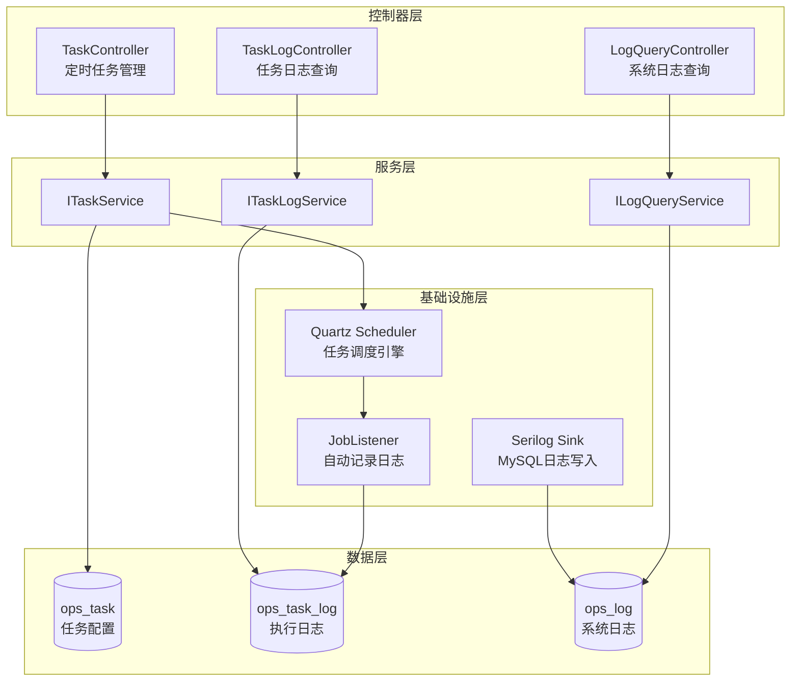

# Ops（运维管理）模块设计文档

> **日期：** 2026-09-14
> **状态：** 已评审通过
> **作者：** AI Assistant
> **项目：** EasyProduct.WebApi

---

## 1. 概述

### 1.1 背景

Ops 模块是 EasyProduct 八大业务模块之一，负责运维管理功能，包括：
- 操作日志管理（已完成）
- 登录日志管理（已完成）
- 定时任务管理（待开发）
- 任务日志管理（待开发）
- 系统日志查询（待开发）

### 1.2 开发范围

本次开发包含以下 3 个子系统：

1. **定时任务管理**：任务的 CRUD、启动/暂停、立即执行
2. **任务日志管理**：记录任务执行历史（成功/失败、耗时、错误信息）
3. **系统日志查询**：查询 Serilog 记录的系统日志

### 1.3 技术选型

- **任务调度**：Quartz 3.14.x（编译时注册方式）
- **日志记录**：Serilog 8.x + MySQL Sink
- **数据访问**：SqlSugarCore 5.1.4.x
- **数据库**：MySQL 8.0

---

## 2. 整体架构

### 2.1 架构图



### 2.2 分层职责

| 层次 | 职责 |
|------|------|
| **控制器层** | 接收请求、参数验证、调用服务、返回响应 |
| **服务层** | 业务逻辑、事务管理、调用 Quartz/数据库 |
| **基础设施层** | Quartz 调度、JobListener 监听、Serilog 日志写入 |
| **数据层** | SqlSugar ORM 操作 MySQL |

### 2.3 数据流向

- **任务管理**：Controller → Service → Quartz API + MySQL
- **任务执行**：Quartz 触发 Job → JobListener 记录日志 → MySQL
- **日志查询**：Controller → Service → MySQL 直接查询

---

## 3. 数据库设计

### 3.1 ops_task（定时任务配置表）

```sql
CREATE TABLE `ops_task` (
  `id` char(36) NOT NULL COMMENT '主键ID',
  `name` varchar(100) NOT NULL COMMENT '任务名称',
  `code` varchar(50) NOT NULL COMMENT '任务编码（唯一标识）',
  `task_group` varchar(50) NOT NULL DEFAULT 'system' COMMENT '任务分组：system/crm/mall',
  `cron` varchar(100) NOT NULL COMMENT 'Cron表达式',
  `job_class` varchar(200) NOT NULL COMMENT '任务实现类全名',
  `description` varchar(500) DEFAULT NULL COMMENT '任务描述',
  `status` int NOT NULL DEFAULT 0 COMMENT '状态：0-暂停，1-运行',
  `last_run_time` datetime DEFAULT NULL COMMENT '最后执行时间',
  `next_run_time` datetime DEFAULT NULL COMMENT '下次执行时间',
  `create_time` datetime NOT NULL DEFAULT CURRENT_TIMESTAMP COMMENT '创建时间',
  `update_time` datetime NOT NULL DEFAULT CURRENT_TIMESTAMP ON UPDATE CURRENT_TIMESTAMP COMMENT '更新时间',
  `create_by` varchar(50) DEFAULT NULL COMMENT '创建人',
  `is_deleted` int NOT NULL DEFAULT 0 COMMENT '是否删除：0-否，1-是',
  PRIMARY KEY (`id`),
  UNIQUE KEY `uk_code` (`code`),
  KEY `idx_status` (`status`),
  KEY `idx_group` (`task_group`)
) ENGINE=InnoDB DEFAULT CHARSET=utf8mb4 COMMENT='定时任务配置表';
```

**字段说明**：
- `code`：业务唯一标识，用于 Quartz JobKey
- `job_class`：实现 `IJob` 接口的类全名（如 `EasyProduct.Jobs.OrderStatusSyncJob`）
- `status`：0=暂停，1=运行（对应 Quartz 的暂停/恢复）
- `last_run_time`/`next_run_time`：从 Quartz Trigger 同步获取

---

### 3.2 ops_task_log（任务执行日志表）

```sql
CREATE TABLE `ops_task_log` (
  `id` char(36) NOT NULL COMMENT '主键ID',
  `task_id` char(36) NOT NULL COMMENT '任务ID',
  `task_name` varchar(100) NOT NULL COMMENT '任务名称（冗余，便于查询）',
  `task_code` varchar(50) NOT NULL COMMENT '任务编码（冗余）',
  `start_time` datetime NOT NULL COMMENT '开始时间',
  `end_time` datetime DEFAULT NULL COMMENT '结束时间',
  `duration` int DEFAULT NULL COMMENT '执行耗时（毫秒）',
  `status` int NOT NULL DEFAULT 0 COMMENT '执行状态：0-进行中，1-成功，2-失败',
  `error_message` text COMMENT '错误信息',
  `stack_trace` text COMMENT '异常堆栈',
  `create_time` datetime NOT NULL DEFAULT CURRENT_TIMESTAMP COMMENT '创建时间',
  PRIMARY KEY (`id`),
  KEY `idx_task_id` (`task_id`),
  KEY `idx_start_time` (`start_time`),
  KEY `idx_status` (`status`),
  CONSTRAINT `fk_task_log_task` FOREIGN KEY (`task_id`) REFERENCES `ops_task` (`id`) ON DELETE CASCADE
) ENGINE=InnoDB DEFAULT CHARSET=utf8mb4 COMMENT='任务执行日志表';
```

**字段说明**：
- `status`：0=进行中，1=成功，2=失败
- `duration`：`end_time - start_time`（毫秒）
- `error_message`/`stack_trace`：任务异常时记录详细信息
- **外键级联删除**：删除任务时自动删除其执行日志

---

### 3.3 ops_log（系统日志表）

```sql
CREATE TABLE `ops_log` (
  `id` char(36) NOT NULL COMMENT '主键ID',
  `level` varchar(20) NOT NULL COMMENT '日志级别：Information/Warning/Error/Fatal',
  `module` varchar(50) DEFAULT NULL COMMENT '模块：Basic/Site/Product/Mall/Crm/Workflow/Report/Ops',
  `message` text NOT NULL COMMENT '日志内容',
  `user_id` char(36) DEFAULT NULL COMMENT '操作用户ID',
  `user_name` varchar(50) DEFAULT NULL COMMENT '操作用户名',
  `ip` varchar(50) DEFAULT NULL COMMENT 'IP地址',
  `request_url` varchar(500) DEFAULT NULL COMMENT '请求URL',
  `request_method` varchar(10) DEFAULT NULL COMMENT '请求方法：GET/POST/PUT/DELETE',
  `stack_trace` text COMMENT '异常堆栈',
  `properties` text COMMENT '附加属性（JSON格式）',
  `create_time` datetime NOT NULL DEFAULT CURRENT_TIMESTAMP COMMENT '创建时间',
  PRIMARY KEY (`id`),
  KEY `idx_level` (`level`),
  KEY `idx_module` (`module`),
  KEY `idx_create_time` (`create_time`),
  KEY `idx_user_id` (`user_id`)
) ENGINE=InnoDB DEFAULT CHARSET=utf8mb4 COMMENT='系统日志表';
```

**字段说明**：
- `level`：对应 Serilog 的 LogEventLevel
- `module`：从 LogContext 推送的业务模块标识
- `user_id`/`user_name`：从 ClaimsPrincipal 提取当前用户信息
- `request_url`/`request_method`：从 HttpContext 提取请求信息
- `stack_trace`：异常日志时记录完整堆栈
- `properties`：Serilog 的结构化属性（JSON 序列化）

**索引策略**：
- 按级别、模块、时间、用户查询都有索引支持
- **时间索引**：支持按时间范围筛选（最近 7 天、30 天等）

---

### 3.4 初始数据

**ops_task 示例数据**（与 Mock 对齐）：

```sql
INSERT INTO `ops_task` (`id`, `name`, `code`, `task_group`, `cron`, `job_class`, `description`, `status`) VALUES
('task-001', 'Order Status Sync', 'ORDER_STATUS_SYNC', 'mall', '0 */5 * * * ?', 'EasyProduct.Jobs.OrderStatusSyncJob', '每5分钟同步商城订单状态', 1),
('task-002', 'Stock Alert Check', 'STOCK_ALERT_CHECK', 'crm', '0 0 * * * ?', 'EasyProduct.Jobs.StockAlertJob', '每小时检查库存预警', 1),
('task-003', 'ARAP Aging Report', 'ARAP_AGING_REPORT', 'crm', '0 0 0 1 * ?', 'EasyProduct.Jobs.ArapAgingJob', '每月1日生成账龄分析报告', 1),
('task-004', 'Session Cleanup', 'SESSION_CLEANUP', 'system', '0 0 2 * * ?', 'EasyProduct.Jobs.SessionCleanupJob', '每天凌晨2点清理过期会话', 1),
('task-005', 'Log Cleanup', 'LOG_CLEANUP', 'system', '0 0 3 * * ?', 'EasyProduct.Jobs.LogCleanupJob', '每天凌晨3点清理30天前的日志', 1);
```

---

## 4. API 接口设计

### 4.1 定时任务管理接口

**路由前缀**：`/api/admin/ops/task`

| 方法 | 路由 | 说明 | 权限标识 |
|------|------|------|----------|
| GET | `/list` | 获取任务分页列表 | `ops:task:list` |
| GET | `/{id}` | 获取任务详情 | `ops:task:view` |
| POST | `/` | 创建任务 | `ops:task:create` |
| PUT | `/{id}` | 更新任务 | `ops:task:update` |
| DELETE | `/{id}` | 删除任务 | `ops:task:delete` |
| POST | `/{id}/start` | 启动任务 | `ops:task:execute` |
| POST | `/{id}/pause` | 暂停任务 | `ops:task:execute` |
| POST | `/{id}/trigger` | 立即执行一次 | `ops:task:execute` |

#### 4.1.1 GET `/api/admin/ops/task/list`

**请求参数**（Query）：
```typescript
{
  keyword?: string      // 关键词搜索（名称、编码）
  status?: number       // 状态：0-暂停，1-运行
  taskGroup?: string    // 任务分组
  pageIndex: number     // 页码，默认1
  pageSize: number      // 每页数量，默认10
}
```

**响应**：
```typescript
ApiResponse<PageResponse<TaskDto>> {
  code: 200,
  message: "success",
  data: {
    list: TaskDto[],
    total: number
  }
}

// TaskDto
{
  id: string
  name: string
  code: string
  taskGroup: string
  cron: string
  cronDescription: string  // Cron 中文描述
  jobClass: string
  description: string
  status: number
  statusText: string       // 状态文本
  lastRunTime: string
  nextRunTime: string
  createTime: string
  updateTime: string
}
```

---

#### 4.1.2 POST `/api/admin/ops/task`

**请求体**：
```typescript
{
  name: string           // 必填，最大100字符
  code: string           // 必填，唯一，最大50字符
  taskGroup: string      // 必填，默认"system"
  cron: string           // 必填，Cron表达式
  jobClass: string       // 必填，实现IJob的类全名
  description?: string   // 可选，最大500字符
}
```

**响应**：
```typescript
ApiResponse<object> {
  code: 200,
  message: "创建成功",
  data: "new-task-id"
}
```

**业务规则**：
1. 验证 `code` 唯一性
2. 验证 `cron` 表达式格式（使用 Quartz CronExpression.IsValidExpression）
3. 验证 `jobClass` 是否存在（通过反射检查类是否存在且实现 IJob）
4. 默认状态为暂停（status=0）

---

#### 4.1.3 PUT `/api/admin/ops/task/{id}`

**请求体**：
```typescript
{
  name?: string
  taskGroup?: string
  cron?: string
  jobClass?: string
  description?: string
}
```

**响应**：
```typescript
ApiResponse<bool> {
  code: 200,
  message: "更新成功",
  data: true
}
```

**业务规则**：
1. `code` 不可修改（业务主键）
2. 如果任务正在运行中，更新后自动重启（先暂停再恢复）
3. 验证逻辑同创建

---

#### 4.1.4 POST `/api/admin/ops/task/{id}/start`

**响应**：
```typescript
ApiResponse<bool> {
  code: 200,
  message: "任务已启动",
  data: true
}
```

**业务逻辑**：
1. 调用 `scheduler.ResumeJob(jobKey)`
2. 更新数据库 `status = 1`
3. 同步 `nextRunTime`（从 Trigger 获取）

---

#### 4.1.5 POST `/api/admin/ops/task/{id}/pause`

**响应**：
```typescript
ApiResponse<bool> {
  code: 200,
  message: "任务已暂停",
  data: true
}
```

**业务逻辑**：
1. 调用 `scheduler.PauseJob(jobKey)`
2. 更新数据库 `status = 0`

---

#### 4.1.6 POST `/api/admin/ops/task/{id}/trigger`

**响应**：
```typescript
ApiResponse<bool> {
  code: 200,
  message: "任务已触发执行",
  data: true
}
```

**业务逻辑**：
1. 调用 `scheduler.TriggerJob(jobKey)` 立即执行一次
2. 不影响原有调度计划
3. 执行日志由 JobListener 自动记录

---

### 4.2 任务日志接口

**路由前缀**：`/api/admin/ops/task-log`

| 方法 | 路由 | 说明 | 权限标识 |
|------|------|------|----------|
| GET | `/list` | 获取任务日志分页列表 | `ops:task-log:list` |
| GET | `/{id}` | 获取任务日志详情 | `ops:task-log:view` |

#### 4.2.1 GET `/api/admin/ops/task-log/list`

**请求参数**（Query）：
```typescript
{
  taskId?: string        // 任务ID
  status?: number        // 执行状态：0-进行中，1-成功，2-失败
  startDate?: string     // 开始时间
  endDate?: string       // 结束时间
  keyword?: string       // 关键词搜索（任务名称、错误信息）
  pageIndex: number
  pageSize: number
}
```

**响应**：
```typescript
ApiResponse<PageResponse<TaskLogDto>> {
  code: 200,
  message: "success",
  data: {
    list: TaskLogDto[],
    total: number
  }
}

// TaskLogDto
{
  id: string
  taskId: string
  taskName: string
  taskCode: string
  startTime: string
  endTime: string
  duration: number       // 毫秒
  status: number
  statusText: string
  errorMessage: string
  createTime: string
}
```

**排序规则**：按 `start_time` 倒序

---

#### 4.2.2 GET `/api/admin/ops/task-log/{id}`

**响应**：
```typescript
ApiResponse<TaskLogDetailDto> {
  code: 200,
  message: "success",
  data: {
    id: string
    taskId: string
    taskName: string
    taskCode: string
    startTime: string
    endTime: string
    duration: number
    status: number
    statusText: string
    errorMessage: string
    stackTrace: string      // 完整异常堆栈
    createTime: string
  }
}
```

---

### 4.3 系统日志查询接口

**路由前缀**：`/api/admin/ops/log`

| 方法 | 路由 | 说明 | 权限标识 |
|------|------|------|----------|
| GET | `/list` | 获取系统日志分页列表 | `ops:log:list` |
| GET | `/{id}` | 获取系统日志详情 | `ops:log:view` |

#### 4.3.1 GET `/api/admin/ops/log/list`

**请求参数**（Query）：
```typescript
{
  level?: string         // 日志级别：Information/Warning/Error/Fatal
  module?: string        // 模块
  userName?: string      // 操作用户名
  startDate?: string     // 开始时间
  endDate?: string       // 结束时间
  keyword?: string       // 关键词搜索（日志内容、用户名、IP）
  pageIndex: number
  pageSize: number
}
```

**响应**：
```typescript
ApiResponse<PageResponse<LogQueryDto>> {
  code: 200,
  message: "success",
  data: {
    list: LogQueryDto[],
    total: number
  }
}

// LogQueryDto
{
  id: string
  level: string
  levelText: string       // 级别文本：信息/警告/错误/严重
  module: string
  message: string
  userName: string
  ip: string
  requestUrl: string
  createTime: string
}
```

**排序规则**：按 `create_time` 倒序

---

#### 4.3.2 GET `/api/admin/ops/log/{id}`

**响应**：
```typescript
ApiResponse<LogQueryDetailDto> {
  code: 200,
  message: "success",
  data: {
    id: string
    level: string
    levelText: string
    module: string
    message: string
    userId: string
    userName: string
    ip: string
    requestUrl: string
    requestMethod: string
    stackTrace: string
    properties: string     // JSON格式附加属性
    createTime: string
  }
}
```

---

### 4.4 权限标识汇总

| 权限标识 | 说明 | 对应菜单 |
|---------|------|----------|
| `ops:task:list` | 任务列表 | 运维日志 > 定时任务 |
| `ops:task:view` | 任务详情 | 运维日志 > 定时任务 |
| `ops:task:create` | 创建任务 | 运维日志 > 定时任务 |
| `ops:task:update` | 更新任务 | 运维日志 > 定时任务 |
| `ops:task:delete` | 删除任务 | 运维日志 > 定时任务 |
| `ops:task:execute` | 执行任务（启动/暂停/触发） | 运维日志 > 定时任务 |
| `ops:task-log:list` | 任务日志列表 | 运维日志 > 任务日志 |
| `ops:task-log:view` | 任务日志详情 | 运维日志 > 任务日志 |
| `ops:log:list` | 系统日志列表 | 运维日志 > 日志查询 |
| `ops:log:view` | 系统日志详情 | 运维日志 > 日志查询 |

---

## 5. 核心组件实现

### 5.1 Quartz 集成与任务注册

#### 5.1.1 Quartz 配置

**依赖注入注册**（Program.cs）：

```csharp
// 添加 Quartz 服务
builder.Services.AddQuartz(q =>
{
    q.UseMicrosoftDependencyInjectionJobFactory();

    // 从数据库加载任务配置并注册
    q.UsePersistentStore(store =>
    {
        store.UseProperties = false;
        store.UseMySql(ops =>
        {
            ops.ConnectionString = builder.Configuration.GetConnectionString("DefaultConnection");
            ops.TablePrefix = "QRTZ_";
        });
        store.UseJsonSerializer();
    });
});

builder.Services.AddQuartzHostedService(q => q.WaitForJobsToComplete = true);
```

**说明**：
- 使用持久化存储（MySQL），Quartz 自动创建 `QRTZ_*` 前缀表
- `WaitForJobsToComplete = true`：应用停止时等待任务完成

---

#### 5.1.2 任务启动加载器

**TaskSchedulerInitializer.cs**：

```csharp
/// <summary>
/// 任务调度器初始化器，应用启动时从数据库加载任务配置
/// </summary>
public class TaskSchedulerInitializer : IHostedService
{
    private readonly ISchedulerFactory _schedulerFactory;
    private readonly ILogger<TaskSchedulerInitializer> _logger;

    public TaskSchedulerInitializer(
        ISchedulerFactory schedulerFactory,
        ILogger<TaskSchedulerInitializer> logger)
    {
        _schedulerFactory = schedulerFactory;
        _logger = logger;
    }

    /// <summary>
    /// 应用启动时加载所有运行中的任务
    /// </summary>
    public async Task StartAsync(CancellationToken cancellationToken)
    {
        _logger.LogInformation("开始加载定时任务配置...");

        var scheduler = await _schedulerFactory.GetScheduler(cancellationToken);

        // 从数据库查询所有运行中的任务（status = 1）
        var taskService = _serviceProvider.GetRequiredService<ITaskService>();
        var runningTasks = await taskService.GetRunningTasksAsync();

        foreach (var task in runningTasks)
        {
            await RegisterJobAsync(scheduler, task, cancellationToken);
        }

        await scheduler.Start(cancellationToken);
        _logger.LogInformation("定时任务加载完成，共加载 {Count} 个任务", runningTasks.Count);
    }

    /// <summary>
    /// 注册单个任务到 Quartz
    /// </summary>
    private async Task RegisterJobAsync(
        IScheduler scheduler,
        TaskDto task,
        CancellationToken cancellationToken)
    {
        try
        {
            // 创建 JobDetail
            var jobKey = new JobKey(task.Code, task.TaskGroup);
            var jobType = Type.GetType(task.JobClass);

            if (jobType == null)
            {
                _logger.LogError("任务类不存在：{JobClass}", task.JobClass);
                return;
            }

            var jobDetail = JobBuilder.Create(jobType)
                .WithIdentity(jobKey)
                .WithDescription(task.Description)
                .Build();

            // 创建 Trigger
            var trigger = TriggerBuilder.Create()
                .WithIdentity($"{task.Code}_trigger", task.TaskGroup)
                .WithCronSchedule(task.Cron)
                .Build();

            // 注册到调度器
            await scheduler.ScheduleJob(jobDetail, trigger, cancellationToken);

            // 更新下次执行时间
            await taskService.UpdateNextRunTimeAsync(task.Id, trigger.GetNextFireTimeUtc());

            _logger.LogInformation("任务已注册：{Code}", task.Code);
        }
        catch (Exception ex)
        {
            _logger.LogError(ex, "任务注册失败：{Code}", task.Code);
        }
    }

    public Task StopAsync(CancellationToken cancellationToken)
    {
        return Task.CompletedTask;
    }
}
```

**注册到 DI**：

```csharp
builder.Services.AddHostedService<TaskSchedulerInitializer>();
```

---

### 5.2 JobListener 自动记录日志

#### 5.2.1 任务监听器

**TaskExecutionListener.cs**：

```csharp
/// <summary>
/// 任务执行监听器，自动记录任务执行日志
/// </summary>
public class TaskExecutionListener : IJobListener
{
    private readonly ILogger<TaskExecutionListener> _logger;
    private readonly IServiceScopeFactory _scopeFactory;

    public string Name => "TaskExecutionListener";

    public TaskExecutionListener(
        ILogger<TaskExecutionListener> logger,
        IServiceScopeFactory scopeFactory)
    {
        _logger = logger;
        _scopeFactory = scopeFactory;
    }

    /// <summary>
    /// 任务执行前
    /// </summary>
    public async Task JobToBeExecuted(
        IJobExecutionContext context,
        CancellationToken cancellationToken = default)
    {
        var jobKey = context.JobDetail.Key;
        var startTime = DateTime.UtcNow;

        _logger.LogInformation("任务开始执行：{JobKey}", jobKey);

        // 创建执行日志记录
        using var scope = _scopeFactory.CreateScope();
        var taskLogService = scope.ServiceProvider.GetRequiredService<ITaskLogService>();

        var logId = await taskLogService.CreateAsync(new CreateTaskLogDto
        {
            TaskCode = jobKey.Name,
            StartTime = startTime
        });

        // 保存 logId 到 JobDataMap，供后续使用
        context.JobDetail.JobDataMap["TaskLogId"] = logId;
    }

    /// <summary>
    /// 任务执行完成
    /// </summary>
    public async Task JobWasExecuted(
        IJobExecutionContext context,
        JobExecutionException? jobException,
        CancellationToken cancellationToken = default)
    {
        var jobKey = context.JobDetail.Key;
        var endTime = DateTime.UtcNow;
        var startTime = context.FireTimeUtc.UtcDateTime;
        var duration = (int)(endTime - startTime).TotalMilliseconds;
        var taskLogId = context.JobDetail.JobDataMap.GetString("TaskLogId");

        using var scope = _scopeFactory.CreateScope();
        var taskLogService = scope.ServiceProvider.GetRequiredService<ITaskLogService>();
        var taskService = scope.ServiceProvider.GetRequiredService<ITaskService>();

        if (jobException != null)
        {
            // 执行失败
            _logger.LogError(jobException, "任务执行失败：{JobKey}", jobKey);

            await taskLogService.UpdateAsync(taskLogId, new UpdateTaskLogDto
            {
                EndTime = endTime,
                Duration = duration,
                Status = 2, // 失败
                ErrorMessage = jobException.Message,
                StackTrace = jobException.StackTrace
            });
        }
        else
        {
            // 执行成功
            _logger.LogInformation("任务执行成功：{JobKey}，耗时 {Duration}ms", jobKey, duration);

            await taskLogService.UpdateAsync(taskLogId, new UpdateTaskLogDto
            {
                EndTime = endTime,
                Duration = duration,
                Status = 1, // 成功
            });
        }

        // 更新任务的最后执行时间
        await taskService.UpdateLastRunTimeAsync(jobKey.Name, startTime);
    }

    public Task JobExecutionVetoed(
        IJobExecutionContext context,
        CancellationToken cancellationToken = default)
    {
        return Task.CompletedTask;
    }
}
```

**注册监听器**：

```csharp
// 在 TaskSchedulerInitializer.StartAsync 中添加
scheduler.ListenerManager.AddJobListener(new TaskExecutionListener(logger, scopeFactory));
```

---

### 5.3 Serilog MySQL Sink 实现

#### 5.3.1 自定义 MySQL Sink

**MySqlLogSink.cs**：

```csharp
/// <summary>
/// Serilog MySQL 日志 Sink，将日志写入 ops_log 表
/// </summary>
public class MySqlLogSink : ILogEventSink, IDisposable
{
    private readonly ISqlSugarClient _db;
    private readonly ILogger<MySqlLogSink> _logger;

    public MySqlLogSink(ISqlSugarClient db, ILogger<MySqlLogSink> logger)
    {
        _db = db;
        _logger = logger;
    }

    /// <summary>
    /// 写入日志事件
    /// </summary>
    public void Emit(LogEvent logEvent)
    {
        try
        {
            // 提取日志属性
            var module = logEvent.Properties.TryGetValue("Module", out var moduleValue)
                ? moduleValue.ToString().Trim('"')
                : null;

            var userId = logEvent.Properties.TryGetValue("UserId", out var userIdValue)
                ? userIdValue.ToString().Trim('"')
                : null;

            var userName = logEvent.Properties.TryGetValue("UserName", out var userNameValue)
                ? userNameValue.ToString().Trim('"')
                : null;

            var ip = logEvent.Properties.TryGetValue("Ip", out var ipValue)
                ? ipValue.ToString().Trim('"')
                : null;

            var requestUrl = logEvent.Properties.TryGetValue("RequestUrl", out var urlValue)
                ? urlValue.ToString().Trim('"')
                : null;

            var requestMethod = logEvent.Properties.TryGetValue("RequestMethod", out var methodValue)
                ? methodValue.ToString().Trim('"')
                : null;

            // 提取异常堆栈
            string? stackTrace = null;
            if (logEvent.Exception != null)
            {
                stackTrace = logEvent.Exception.ToString();
            }

            // 序列化其他属性
            var properties = JsonSerializer.Serialize(
                logEvent.Properties.ToDictionary(p => p.Key, p => p.Value.ToString())
            );

            // 插入数据库
            _db.Insertable(new OpsLog
            {
                Id = Guid.NewGuid().ToString(),
                Level = logEvent.Level.ToString(),
                Module = module,
                Message = logEvent.RenderMessage(),
                UserId = userId,
                UserName = userName,
                Ip = ip,
                RequestUrl = requestUrl,
                RequestMethod = requestMethod,
                StackTrace = stackTrace,
                Properties = properties,
                CreateTime = logEvent.Timestamp.UtcDateTime
            }).ExecuteCommand();
        }
        catch (Exception ex)
        {
            // 日志写入失败时记录到控制台，避免循环写入
            _logger.LogError(ex, "写入日志到 MySQL 失败");
        }
    }

    public void Dispose()
    {
        // 清理资源
    }
}
```

---

#### 5.3.2 Serilog 配置

**Program.cs**：

```csharp
// 配置 Serilog
builder.Host.UseSerilog((context, services, configuration) =>
{
    configuration
        .ReadFrom.Configuration(context.Configuration)
        .ReadFrom.Services(services)
        .Enrich.FromLogContext()
        .Enrich.WithProperty("Application", "EasyProduct.WebApi")
        .WriteTo.Console()
        .WriteTo.File("logs/log-.txt", rollingInterval: RollingInterval.Day)
        .WriteTo.Sink(new MySqlLogSink(
            services.GetRequiredService<ISqlSugarClient>(),
            services.GetRequiredService<ILogger<MySqlLogSink>>()
        ));
});
```

---

#### 5.3.3 日志上下文推送

**RequestLoggingMiddleware.cs**：

```csharp
/// <summary>
/// 请求日志中间件，自动推送用户信息到 LogContext
/// </summary>
public class RequestLoggingMiddleware
{
    private readonly RequestDelegate _next;

    public RequestLoggingMiddleware(RequestDelegate next)
    {
        _next = next;
    }

    public async Task InvokeAsync(HttpContext context)
    {
        // 提取用户信息
        var userId = context.User?.FindFirst("sub")?.Value;
        var userName = context.User?.FindFirst("name")?.Value;
        var ip = context.Connection.RemoteIpAddress?.ToString();
        var requestUrl = context.Request.Path;
        var requestMethod = context.Request.Method;

        // 推送到 LogContext
        using (LogContext.PushProperty("UserId", userId))
        using (LogContext.PushProperty("UserName", userName))
        using (LogContext.PushProperty("Ip", ip))
        using (LogContext.PushProperty("RequestUrl", requestUrl))
        using (LogContext.PushProperty("RequestMethod", requestMethod))
        {
            await _next(context);
        }
    }
}
```

**业务代码中记录日志**：

```csharp
// 推送模块标识
using (LogContext.PushProperty("Module", "Product"))
{
    _logger.LogInformation("商品创建成功：{ProductName}", product.Name);
}
```

---

### 5.4 示例 Job 实现

**OrderStatusSyncJob.cs**：

```csharp
/// <summary>
/// 订单状态同步任务
/// </summary>
public class OrderStatusSyncJob : IJob
{
    private readonly ILogger<OrderStatusSyncJob> _logger;
    private readonly IOrderService _orderService;

    public OrderStatusSyncJob(
        ILogger<OrderStatusSyncJob> logger,
        IOrderService orderService)
    {
        _logger = logger;
        _orderService = orderService;
    }

    /// <summary>
    /// 执行订单状态同步
    /// </summary>
    public async Task Execute(IJobExecutionContext context)
    {
        _logger.LogInformation("开始执行订单状态同步任务");

        try
        {
            // 业务逻辑：从支付网关同步订单状态
            var syncResult = await _orderService.SyncOrderStatusAsync();

            _logger.LogInformation(
                "订单状态同步完成，成功 {Success} 条，失败 {Fail} 条",
                syncResult.SuccessCount,
                syncResult.FailCount);
        }
        catch (Exception ex)
        {
            _logger.LogError(ex, "订单状态同步任务执行失败");
            throw; // 抛出异常，让 JobListener 记录失败日志
        }
    }
}
```

---

## 6. 错误处理与测试

### 6.1 异常处理策略

| 场景 | 处理方式 |
|------|----------|
| 任务类不存在 | 启动时跳过，记录错误日志 |
| Cron 表达式无效 | 创建/更新时验证，返回 400 错误 |
| 任务执行失败 | JobListener 捕获异常，记录到 `ops_task_log` |
| Serilog 写入失败 | 降级到控制台日志，不影响业务 |
| 数据库连接失败 | Quartz 持久化自动重试 |

### 6.2 单元测试要点

**不需要测试**（框架保证）：
- Quartz 调度器的基础功能
- Serilog 的日志写入

**需要测试**：
1. **任务 CRUD 操作**：验证数据库操作正确性
2. **任务状态管理**：启动/暂停是否正确更新 Quartz 和数据库
3. **JobListener 日志记录**：模拟任务执行，验证日志是否正确记录
4. **Serilog Sink 写入**：模拟 LogEvent，验证数据库插入
5. **Cron 表达式验证**：合法/非法表达式的验证逻辑

---

## 7. 部署与运维

### 7.1 性能优化策略

#### 7.1.1 日志表分区与清理

**表分区**（MySQL 8.0）：

```sql
-- 按月分区
ALTER TABLE `ops_log` PARTITION BY RANGE (YEAR(create_time) * 100 + MONTH(create_time)) (
    PARTITION p202609 VALUES LESS THAN (202610),
    PARTITION p202610 VALUES LESS THAN (202611),
    PARTITION p202611 VALUES LESS THAN (202612),
    PARTITION p_future VALUES LESS THAN MAXVALUE
);
```

**定时清理**（LogCleanupJob）：

```csharp
/// <summary>
/// 日志清理任务，每天凌晨3点清理30天前的日志
/// </summary>
public class LogCleanupJob : IJob
{
    private readonly ISqlSugarClient _db;
    private readonly ILogger<LogCleanupJob> _logger;
    private readonly IConfiguration _config;

    public async Task Execute(IJobExecutionContext context)
    {
        var retentionDays = _config.GetValue("LogRetentionDays", 30);
        var cutoffDate = DateTime.UtcNow.AddDays(-retentionDays);

        _logger.LogInformation("开始清理 {Date} 之前的日志", cutoffDate);

        // 删除过期日志
        var deletedCount = await _db.Deleteable<OpsLog>()
            .Where(log => log.CreateTime < cutoffDate)
            .ExecuteCommandAsync();

        _logger.LogInformation("日志清理完成，删除 {Count} 条记录", deletedCount);
    }
}
```

#### 7.1.2 任务执行优化

**并发控制**：

```csharp
// 任务注解：禁止并发执行
[DisallowConcurrentExecution]
public class OrderStatusSyncJob : IJob
{
    // 同一时间只允许一个实例执行
}
```

**超时控制**：

```csharp
public async Task Execute(IJobExecutionContext context)
{
    using var cts = new CancellationTokenSource(TimeSpan.FromMinutes(5));

    try
    {
        await _orderService.SyncOrderStatusAsync(cts.Token);
    }
    catch (OperationCanceledException)
    {
        _logger.LogWarning("任务执行超时");
        throw;
    }
}
```

---

### 7.2 监控与告警

#### 7.2.1 任务执行监控

**Dashboard 指标**：
- 运行中任务数量
- 今日执行成功率（成功 / 总次数）
- 平均执行耗时
- 失败任务列表（最近 24 小时）

**告警规则**：

| 场景 | 告警条件 | 通知方式 |
|------|----------|----------|
| 任务执行失败 | 连续失败 3 次 | 邮件 + 系统通知 |
| 任务执行超时 | 耗时 > 5 分钟 | 系统通知 |
| 任务未按时执行 | 超过预期时间 10 分钟 | 系统通知 |

#### 7.2.2 日志量监控

**监控指标**：
- 每小时日志写入量
- 错误日志占比
- 慢查询日志数量

---

### 7.3 高可用设计

#### 7.3.1 Quartz 集群部署（可选）

**场景**：多实例部署时，避免任务重复执行

**配置**：

```csharp
// appsettings.json
"Quartz": {
  "quartz.scheduler.instanceName": "EasyProductScheduler",
  "quartz.scheduler.instanceId": "AUTO",
  "quartz.jobStore.clustered": true,
  "quartz.jobStore.tablePrefix": "QRTZ_"
}
```

**注意**：单体部署不需要集群配置

---

### 7.4 安全考虑

#### 7.4.1 权限隔离

| 角色 | 权限 |
|------|------|
| 超级管理员 | 全部权限 |
| 运维管理员 | 任务管理、日志查询 |
| 普通管理员 | 仅日志查询（无删除权限） |

#### 7.4.2 敏感信息保护

**日志脱敏**：

```csharp
// Serilog Enricher：脱敏敏感字段
public class SensitiveDataEnricher : ILogEventEnricher
{
    public void Enrich(LogEvent logEvent, ILogEventPropertyFactory propertyFactory)
    {
        // 脱敏密码、手机号等
        if (logEvent.Properties.TryGetValue("Password", out var password))
        {
            logEvent.AddPropertyIfAbsent(propertyFactory.CreateProperty("Password", "******"));
        }
    }
}
```

---

### 7.5 部署检查清单

**部署前检查**：

- [ ] Quartz 表已创建（`QRTZ_*` 前缀）
- [ ] Ops 表已创建（`ops_task`、`ops_task_log`、`ops_log`）
- [ ] 初始任务数据已导入
- [ ] Serilog MySQL Sink 配置正确
- [ ] 日志清理任务已配置
- [ ] 任务实现类已编译部署
- [ ] 权限菜单已配置

**部署后验证**：

- [ ] 访问 `/api/admin/ops/task/list` 返回任务列表
- [ ] 手动触发任务，验证执行日志记录
- [ ] 执行业务操作，验证系统日志写入
- [ ] 检查日志清理任务是否按计划执行

---

## 8. 开发任务拆分

### 8.1 数据模型层（Task 1）

- 创建实体类：`OpsTask`、`OpsTaskLog`、`OpsLog`
- 创建枚举：`TaskStatus`、`TaskLogStatus`
- 创建 DTO：请求/响应数据传输对象

### 8.2 数据库脚本（Task 2）

- 创建 `ops_task` 表 SQL 脚本
- 创建 `ops_task_log` 表 SQL 脚本
- 创建 `ops_log` 表 SQL 脚本
- 插入初始任务数据

### 8.3 基础设施层（Task 3）

- 实现 `MySqlLogSink`
- 实现 `RequestLoggingMiddleware`
- 实现 `TaskSchedulerInitializer`
- 实现 `TaskExecutionListener`

### 8.4 服务层（Task 4-6）

- 实现 `ITaskService` 和 `TaskService`
- 实现 `ITaskLogService` 和 `TaskLogService`
- 实现 `ILogQueryService` 和 `LogQueryService`

### 8.5 控制器层（Task 7-9）

- 实现 `TaskController`
- 实现 `TaskLogController`
- 实现 `LogQueryController`

### 8.6 示例任务实现（Task 10）

- 实现 `OrderStatusSyncJob`
- 实现 `StockAlertJob`
- 实现 `LogCleanupJob`

### 8.7 集成测试与验证（Task 11）

- 测试任务 CRUD 操作
- 测试任务执行和日志记录
- 测试系统日志写入和查询
- 验证日志清理功能

---

## 9. 风险与注意事项

### 9.1 技术风险

1. **日志表数据量增长快**：需要定期清理，建议按月分区
2. **任务执行失败重试**：需要实现重试机制，避免无限重试
3. **Serilog 写入性能**：建议使用异步写入或批量写入优化

### 9.2 业务风险

1. **任务执行顺序依赖**：需要确保任务间无循环依赖
2. **任务执行时间冲突**：建议错峰执行，避免资源争抢
3. **日志敏感信息泄露**：需要脱敏处理

### 9.3 运维风险

1. **任务配置错误**：需要验证 Cron 表达式和任务类名
2. **日志清理策略不当**：需要平衡存储成本和审计需求
3. **监控告警配置缺失**：需要配置合理的告警规则

---

## 10. 附录

### 10.1 参考资料

- [Quartz.NET 官方文档](https://www.quartz-scheduler.net/)
- [Serilog 官方文档](https://serilog.net/)
- [EasyProduct 后端开发规范](../backend-guidelines.md)
- [EasyProduct 整合设计方案](./2026-08-08-easyproduct-integration-design.md)

### 10.2 变更记录

| 版本 | 日期 | 作者 | 变更说明 |
|------|------|------|----------|
| 1.0 | 2026-09-14 | AI Assistant | 初始版本 |

---

**文档结束**